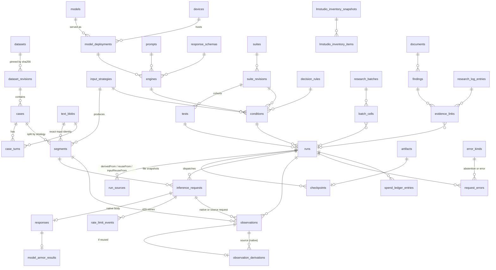

# Research database (Supabase / Postgres)

This is a private Postgres schema for the injection-detection research data that is **not** on GitHub. That data is the git-ignored
`evals/runs/` (about 1.0 GB, about 1,240 files) and `evals/private/` (about 882 MB), plus the tracked metadata that gives
it meaning (`evals/datasets/*.json`, `evals/suites/*.json`, `evals/src/types.ts`, reports, `FINDINGS.md`).

- **Source of truth:** `supabase/migrations/*.sql`, applied in filename order. There is no separate schema snapshot.
- **Single user, private:** every object lives in the `evals` schema, nothing is granted to `anon`, every table has RLS
  with owner-only policies, and the Data API does not expose `evals` unless you add it.
- **Nothing here touches `evals/runs` or `evals/private`.** `check_import_assumptions.py` is read-only.

| File | Purpose |
| --- | --- |
| `supabase/config.toml` | Minimal CLI config with no secrets. `evals` is not in `[api].schemas`. |
| `supabase/migrations/20261004090000_extensions_and_enums.sql` | `evals` schema, pgcrypto, owner allowlist, `is_owner()`, the policy helper, the `sha256_hex` domain, enums |
| `…090100_reference_metadata.sql` | artifacts, datasets/revisions, models/deployments/devices, prompts, response schemas, engines, input strategies, decision rules, suites/revisions, tests, conditions |
| `…090200_cases_and_segments.sql` | content-addressed `text_blobs`, cases, turns, segments |
| `…090300_runs_and_observations.sql` | runs, run sources (derivation and reuse), checkpoints, requests, rate limits, responses, Model Armor results, LM Studio instance snapshots, observations, derivations, error kinds, errors |
| `…090400_budget_inventory_reports.sql` | batches and cells, spend ledger, key snapshots, endpoint snapshots and offers, LM Studio inventories, driver events, file inventories, analysis documents, coverage cells, case evidence tags, documents, research-log entries, findings, evidence links |
| `…090500_analysis_views.sql` | outcome, verdict, rate, paired-delta, spend, lineage and catalog views |
| `…090600_rls_and_storage.sql` | re-applies policies, asserts RLS on every table, revokes anon/PUBLIC, creates private Storage buckets and object policies |
| `…20261005090000_importer_behavior_lineage.sql` | importer bookkeeping (`import_files`), response detail (`reasoning_text`, `parsed_output`, Storage path of the raw body), model-card provenance, R/L log ids, injection payload columns on `cases`, `counterfactual_pairs`, `behavior_assessments`, prompt lineage, and the views `v_prompt_lineage`, `v_paired_target_tracking`, `v_observation_behavior`, `v_window_level_following` |
| `…20261006090000_lmstudio_native_speed.sql` | nullable LM Studio native-v0 speed columns on `responses` (`ttft_s`, `tokens_per_second`, `generation_time_s`, `stop_reason`, `model_format`, `model_quant`, `client_http_wall_ms`) and `envelope_version` widened to `lmstudio-provenance/v1|v2`. See [LM Studio native-v0 speed stats](#lm-studio-native-v0-speed-stats-migration-20261006090000) |
| `…20261006091000_lmstudio_speed_comment_fix.sql` | comment-only: `generation_time_s` includes TTFT on llama.cpp but not on MLX |
| `evals/db/import/` | The TypeScript/Bun importer (`bun run db:import`), its model-card catalog and its unit tests. See [Importer](#importer) |
| `supabase/optional/publish_aggregate_views.sql` | **Not applied.** A commented template for publishing aggregate-only materialized views later |
| `evals/db/check_import_assumptions.py` | Read-only scan of `evals/runs` that checks the identity assumptions below |

## Applying the migrations

```sh
# Hosted project, with the Supabase CLI
supabase link --project-ref <ref>
supabase db push                 # applies pending files in supabase/migrations
# Local stack
supabase start && supabase migration up
# Plain Postgres 15+ (also works; role/auth/storage shims are guarded)
for f in supabase/migrations/*.sql; do psql "$DATABASE_URL" -v ON_ERROR_STOP=1 -f "$f"; done
```

Then register yourself as the owner. Use service_role or the SQL editor; `authenticated` cannot write this table:

```sql
insert into evals.owners (user_id, note) values ('<auth.users.id>', 'owner');
```

The importer should connect as `service_role` (or the `postgres` role), which bypasses RLS. Querying through the
Data API requires adding `evals` to the exposed schemas. Even then, only the listed owner sees rows.

**Adding a migration:** run `supabase migration new <name>` (or create `supabase/migrations/<YYYYMMDDHHMMSS>_<name>.sql` with a
later timestamp). Never edit an applied file. Every new table must, in the same file:
`alter table evals.<t> enable row level security; select evals.apply_owner_policies('evals.<t>');`. The final RLS
assertion in `090600` fails on re-run if a table lacks RLS, so re-run it (or copy its assertion block) after adding
tables. Extend an enum with `alter type evals.<enum> add value if not exists '<v>';`. Use `create … if not exists`,
`create or replace view` and `drop policy if exists` so files stay re-runnable.

## ER overview



## Key identities (checked against the real files)

`check_import_assumptions.py` confirmed these on 2026-10-04, while another agent was still appending checkpoints:

| Identity | Natural key | Notes |
| --- | --- | --- |
| Dataset revision | `(dataset_id, revision)`. `revision = 'sha256:' ‖ source sha256` | 21 manifests |
| Case | `(dataset_revision, case_id)`. `text_sha256` = sha256 of turns joined by `\n` | about 7,330 cases referenced |
| Segment | `(case, strategy config hash, index)` | `segment_id` (`<caseId>/<n>`) repeats across strategies. About 60.8k segments and 37.4k distinct input hashes |
| Engine | `engineConfigSha256` = sha256(`JSON.stringify(engine)`) | 51 ids, one hash each. Python `json.dumps(..., separators=(',',':'), ensure_ascii=False)` reproduces every hash |
| Strategy | `inputStrategySha256` | 10 ids |
| Decision rule | importer sha256 of the rule JSON | 3 suite rules, plus replay rules |
| Run | `metadata.runId` | 642 runs in 643 files. One run is a byte-identical copy at two paths (two checkpoints, one run) |
| Request | `requestId` (UUID) | Unique across all checkpoints. 429 retries reuse it with `attempt` 2..8 |
| Observation | `(run, segment)` | Derived observations keep the **source** `requestId`, so `request_id` is not unique on observations |
| Checkpoint snapshot | `(path, sha256)` on `artifacts` | Growing files get a new artifact row at each import |
| Append-only logs | `(path, line_no)` plus `line_sha256` | Ledgers, driver logs |

## Record types found and their mapping

Counts are from the scan on 2026-10-04 and are still growing.

| Source record | Count | Table(s) |
| --- | ---: | --- |
| `metadata` (`security-eval-run/v1`) | 643 | `runs` (+`metadata` jsonb), `run_sources` (`derivedFrom` 69, `reuseFrom` 3, `inputReuseFrom` 3), engine/strategy/rule upserts, `suite_revisions` (hash-only if the file changed) |
| `dispatch` {requestId, attempt} | 247.8k | `inference_requests` (attempts folded into `attempts`, `first/last_dispatch_at`) |
| `rateLimit` {delayMs, raw?} | 3.7k | `rate_limit_events` |
| `response` {raw} | 244k | `responses` (shape-specific extraction), `model_armor_results`, `lmstudio_instance_snapshots` (before/after) |
| `observation` {value} | 243.8k | `observations` (`origin = native`) |
| `derived_observation` {value, raw, source*} | 75.4k | `observations` (non-native origin) + `observation_derivations`. The duplicated `raw` is **not** stored; it is checked against the source response's `raw_sha256` (`raw_matches_source`) |
| `error` {issue, errorName, wireResponse, httpFailure} | 293 | `request_errors`. Issue kinds: provider_or_transport_error 220, output_abstention 52, research_dispatch_cap 16, http_error 7 |
| `complete` {observations} | 593 | `checkpoints.has_complete_marker`, `runs.completeness = complete` |
| `migrated-2026-09/observations.jsonl` (untyped) | 52,335 | `runs` (`origin = legacy_migrated`), `observations` (`legacy_migrated`, null request id) |
| `migrated-2026-09/manifest.json` | 1 | `analysis_documents` (verification totals) |
| Legacy `assistant-2026-09/*events*.jsonl` (`chunk`, `score`, `modelArmor`, `chatResponse`, `result`, `dispatch`, `error`, `complete`) | about 120k | `artifacts` + Storage only. The canonical rows are the migrated observations above, which reference these files through `source_artifact` |
| `batch-ledger.jsonl` (`batch_start/finish`, `condition_start/finish`, `budget_stop`) | 44 + 597 + 8 | `research_batches`, `batch_cells`, `spend_ledger_entries` (`openrouter_usage`, from `usageDeltaUsd`) |
| `armor-budget-2026-09-29.jsonl` (`baseline`, `reserve`) | 1 + 41k | `spend_ledger_entries` (`model_armor_allowance`) |
| `final-budget.json`, batch `initial/final/before/after` | small | `provider_key_snapshots` |
| `model-endpoints-*/*.json`, `openrouter-models-*.json` | 7 | `endpoint_snapshots`, `endpoint_offers` |
| `lmstudio-connection-*/inventory*.json`, driver `inventory` events | about 25 + n | `lmstudio_inventory_snapshots`, `lmstudio_inventory_items` → `model_deployments`, `devices` |
| `driver.ndjson`, `driver-control.ndjson` ({at, value}) | 17 files | `driver_events` |
| `*/artifact-inventory.json` + `inventory-result.json` | 2 × 52k entries | `file_inventories`, `file_inventory_entries` |
| `research-coverage-ledger.json` | 1 | `coverage_cells` + `analysis_documents` |
| Plans, summaries, comparisons, audits, diagnostics, `*-snapshots/<sha>.json` | about 400 | `analysis_documents` (body if under 1 MB), `analysis_document_runs` |
| `attack-following-evidence-*/case-index.jsonl` | 72 | `case_evidence_tags` |
| `*.log`, `console.log`, `*.ts`/`*.py` helper scripts, figures, `research-literature-*` | about 120 | `artifacts` + Storage only |
| `evals/datasets/*.json` | 21 | `datasets`, `dataset_revisions` (license from `provenance.license`) |
| `evals/private/sources/*.jsonl`, `datasets/*.jsonl`, the NotInject JSON | 21 | `cases`, `case_turns`, `text_blobs` (+ Storage `eval-sources`) |
| `*-provenance.json`, `private/upstream/*` | — | `artifacts` (+ optional Storage) |
| `evals/suites/*.json` | 45 | `suites`, `suite_revisions` (content), `tests`, `conditions`, `condition_tests` |
| `evals/reports/*.md`, `research-log-2026-09-29.md`, `FINDINGS.md` | 61 + 2 | `documents`, `research_log_entries` (R0..Rn), `findings` (O1..On), `evidence_links` |

**Response shapes** (`responses.shape`): `openai_chat` (150k: OpenRouter, with usage/cost/reasoning_tokens),
`model_armor_assessment[_native]` (64k: binary verdict, with native `sanitizationResult` and filter version once capture
was added), `jev_answers` (20k: `answers.injection.noul`), `lmstudio_envelope` (9.5k: `lmstudio-provenance/v1`
`{nativeResponse, lmStudio.before/after}`; native-v0 runs from 2026-10-06 use `lmstudio-provenance/v2`, which adds
`endpoint` and `clientTiming`). Finish reasons seen: stop 159k, length 220, error 2.

## Methodology encoded in the schema

- **One observation per segment.** Nothing is aggregated at capture. `v_case_verdicts*` applies a decision rule, so
  thresholds replay over the same saved scores (`decision_rules.origin = 'replay'`).
- **Abstentions are not misses.** `error_kinds.is_abstention` marks `output_abstention` and `length_abstention`. The
  importer assigns `length_abstention` when the paired response has `finish_reason = 'length'`. A case that is
  undecided only because of abstentions has verdict `abstained`. Missing work or hard errors give `incomplete`.
  Rates report `detection_rate` over decided positives and `detection_rate_floor` over all positives.
- **Observed flags.** For max/any rules one scored segment over the threshold decides `flagged`, even when other
  segments are unscored, as `summarize-lmstudio.ts` does. `passed` needs every expected segment scored.
- **Invalid outputs are kept.** `responses.output_text` stores the final content verbatim. Raw bodies of failed
  outputs (`EngineResponseError`) are responses too, and every non-429 HTTP body is in `request_errors.wire_body`.
- **Exact-input reuse is explicit.** Runs carry `origin` and `run_sources`. Observations carry `origin`
  (`derived_segment_equivalence`, `reused_full_input`, `dedup_same_run`, `dedup_native_input`).
  `observation_derivations` links each one to the native observation and request it copies. `v_run_spend` counts only
  native responses as incremental cost. Reused rows are not independent model draws.
- **Limited cohorts are separate.** `runs.case_limit`/`is_limited` exclude `--limit` cohorts from full-cohort pairings.
- **Model Armor is a binary verdict.** `raw_score` stays null. Binary rules apply only to `model_armor` engines.
- **Local caveats are recorded, not hidden.** LM Studio durations include relay and provenance checks. Costs are null,
  not zero. `model_deployments.runtime` says when the runtime build is unknown.

## Views

| View | Use |
| --- | --- |
| `v_run_cases` | Cohort membership (dataset revision + selector + `case_limit` by ordinal) |
| `v_segment_outcomes` | Every expected (run, segment): `scored` / `abstained` / `error` / `unscored` |
| `v_case_verdicts_by_rule`, `v_case_verdicts` | Case verdicts under any applicable rule, or under the run's own rule |
| `v_condition_rates_by_rule`, `v_condition_rates` | Per run (test × condition): detected/missed/clean flags/abstained/incomplete and rates |
| `v_full_vs_window_case_pairs`, `v_full_vs_window_deltas` | Full text vs windows/chunks on the same engine config, rule, dataset, selector, limit and turn selection. Paired counts, McNemar b/c cells, deltas |
| `v_run_spend` | Native requests, attempts, cost, tokens, length-limited responses, reused rows, rate limits, Armor allowance |
| `v_reuse_lineage` | Each reused observation, its source run, and an exact-input check |
| `v_engine_catalog` | Engine → deployment → model (MoE/dense, params, quantization, backend) |
| `v_finding_evidence` | O-ids resolved to runs, including directory-prefix evidence |
| `v_latest_artifacts` | Newest snapshot per path |

`v_segment_outcomes` needs **every expected segment materialized** (by replaying `segmentCase` from
`evals/src/strategies.ts`). Segments recovered only from observations would hide unscored work.

## Storage plan (Supabase Storage, all buckets private)

| Bucket | Contents | Layout | Size |
| --- | --- | --- | --- |
| `eval-runs` | Every file under `evals/runs/` (checkpoints, legacy logs, driver logs, ledgers, inventories, analysis JSON, snapshots, scripts) | `by-sha256/<aa>/<sha256>.<ext>.gz`, content-addressed, so copies and unchanged files dedupe. `artifacts.path → storage_object` | about **92 MB** gzip (measured tar.gz of 1.0 GB; checkpoints compress to 6-7%) |
| `eval-runs` (bodies) | One raw native response body per `responses` row | `responses/<run_id>/<request_id>.json.gz` (gzip of `JSON.stringify(raw)`, whose sha256 is `responses.raw_sha256`). `responses.raw_storage_bucket/raw_storage_object` | see [Importer](#importer) |
| `eval-sources` | `private/sources/*` (datasets + provenance), `private/upstream/*.json` metadata files, git-ignored `datasets/*.jsonl` | `sources/<file stem>/<sha256>.<ext>.gz` | about **14 MB** gzip (measured) |
| `eval-upstream` | **Not used.** Upstream benchmark clones are not uploaded; manifests record their pinned repository URL and commit | — | — |

Per-file limit 50 MB. The largest checkpoint is 64 MB raw and about 5 MB gzip. A response's raw body is at
`responses.raw_storage_object`; it is also line `raw_line_no` of the checkpoint snapshot `raw_artifact_id`.
A growing checkpoint gets a new content-addressed object (and `artifacts` row) each time it is imported, so Storage keeps
every imported snapshot.

## Size estimates and the 500 MB free-tier limit

These were measured by loading synthetic rows at **current production volume** into Postgres 16 with these migrations
(indexes included, without raw bodies or source text):

| Table | Rows | Size |
| --- | ---: | ---: |
| observations | 371k (244k native + 75k reused + 52k legacy) | 134 MB |
| responses (extracted columns, no raw) | 244k | 80 MB |
| inference_requests | 244k | 39 MB |
| segments | 61k | 26 MB |
| observation_derivations | 75k | 20 MB |
| text_blobs (hash only) + cases + turns | about 70k / 7.3k / 15k | 28 MB |
| **Normalized core total** | | **about 337 MB** |
| Plus inventories, analysis bodies, ledgers, driver events, findings (estimate) | | +30-60 MB |

- **Raw response bodies as JSONB: about 350 MB.** A measured 10.9k-body sample took 13 MB as JSONB against 9.5 MB of
  JSON, because rows are too small for TOAST compression. 272 MB of JSON therefore cannot fit on the free tier. Keep raw
  bodies in Storage (`responses.raw` null), and populate `raw` only for errors, abstentions and anomalies
  (about 600 rows).
- **Case text:** about 60 MB raw (about 30-40 MB after TOAST). Storing every distinct segment text would be several
  times larger (estimate). Segments can be rebuilt from case text plus `start_word/end_word`.
- **Free tier (500 MB DB, 1 GB Storage):** the normalized core plus metadata uses about 75-80% of the database. Runs
  are still being added, so expect to outgrow it. On the free tier, skip `file_inventory_entries` and analysis
  bodies over 256 KB. For native rows, `observations.provider/resolved_model/response_ids` can be left null because
  `responses` holds them (about 25 MB saved). **Pro (8 GB)** can hold everything, including raw JSONB
  (about 750 MB total).

## RLS, privacy and licensing

- Every table enables RLS **in the migration that creates it**, with two policies: `owner_all`
  (`authenticated` and `evals.is_owner()`) and `service_role_all`. `evals.owners` is self-read only. Migration
  `090600` asserts that RLS is on for every table, and revokes everything from `anon` and `PUBLIC` (schema, tables,
  sequences, functions). Views are `security_invoker`, so base-table RLS applies through them.
- Storage buckets are `public = false`, and object access needs `evals.is_owner()`.
- **Source datasets carry mixed licenses and visibility.** `llmail-phase2-positive-400` is `visibility: private`. Several
  "public" cohorts inherit research-only or noncommercial terms (PIDS and encoding sets: Qualifire CC BY-NC 4.0,
  Dolly CC BY-SA 3.0; Skill-Inject: inherited skill terms, including Anthropic document-skill terms). NotInject has
  no license recorded in its manifest. **Some licenses restrict redistribution**, so case text, raw bodies (which
  can echo inputs) and source files must never be exposed publicly. `dataset_revisions.redistribution_allowed`
  defaults to false.
- Other private details: `engines.armor_project_ref` (GCP project id), `devices.display_name` (host name), and LM Studio
  device ids.
- The optional `supabase/optional/publish_aggregate_views.sql` shows how to publish **aggregate-only materialized
  views** in a separate `evals_public` schema later (anon reads the stored rows only). Before using it, check that each
  dataset's terms allow publishing derived statistics.

## Importer

`evals/db/import/` is a TypeScript/Bun importer. It reads the repo (never writes to it), writes to Postgres with Bun's
built-in client as the `postgres` role (bypasses RLS), and uploads gzip copies to private Storage with the secret key.
It never modifies, moves or locks anything in `evals/runs` or `evals/private`, never reads `lmstudio-device.lock`, and
never talks to LM Studio.

**Credentials** come from the git-ignored repo-root `.env`, which Bun loads automatically: `SUPABASE_DB_URL` (session
pooler URL), `SUPABASE_URL` (project base URL) and `SUPABASE_SERVICE_ROLE_KEY` (an `sb_secret_…` key;
`SUPABASE_SECRET_KEY` also works). The importer never prints them.

```sh
bun run db:import --dry-run            # parse and map everything; count rows and gzip bytes; no writes, no uploads
bun run db:import --limit=10           # every area, at most 10 files (or 10 bodies) per area
bun run db:import                      # full import / re-sync
bun run db:import --only=checkpoints,bodies,behavior,finalize   # just pick up new checkpoint lines
bun run db:import --verbose            # per-file progress
bun run db:import:test                 # network-free unit tests (no subprocesses)
```

**Areas** (`--only=a,b`; default all, in this order):

| Area | Reads | Writes |
| --- | --- | --- |
| `catalog` | `model-catalog.json`, `evals/src/engines.ts` | `models` (official model cards: architecture, total/active params, `source_url`, `architecture_evidence`), replay `decision_rules`, `prompts` with lineage |
| `datasets` | `evals/datasets/*.json` + their sources via `loadDataset` | `datasets`, `dataset_revisions`, `cases` (+ facet projections and payload columns), `case_turns`, `text_blobs` (full case and turn text in `body`), `counterfactual_pairs` |
| `suites` | `evals/suites/*.json` | `suites`, `suite_revisions` (current), engines (+ deployments, devices, schemas), strategies, rules, `tests`, `conditions`, `condition_tests` |
| `artifacts` | every file under `evals/runs`, `evals/private` (minus upstream clones) and git-ignored `evals/datasets/*.jsonl` | gzip objects in `eval-runs` / `eval-sources`, `artifacts` rows |
| `checkpoints` | every `security-eval-run/v1` checkpoint, live sources first, then input-reuse, reuse and derived runs | `runs`, `run_sources`, `checkpoints`, `segments` (replayed with `segmentCase`), `inference_requests`, `rate_limit_events`, `responses` (+ `reasoning_text`, `parsed_output`), `model_armor_results`, `lmstudio_instance_snapshots`, `observations`, `observation_derivations`, `request_errors`; hash-only `suite_revisions`/tests/conditions when a suite file changed after its runs |
| `bodies` | checkpoint lines of responses without a Storage copy | `responses/<run_id>/<request_id>.json.gz` objects and `responses.raw_storage_*` |
| `legacy` | `migrated-2026-09/observations.jsonl` | 14 `legacy_migrated` runs and their observations |
| `ledgers` | batch ledgers, `armor-budget-*.jsonl`, key snapshots, endpoint snapshots, LM Studio inventories, driver logs, file inventories, coverage ledger, other JSON, `case-index.jsonl` | `research_batches`, `batch_cells`, `spend_ledger_entries`, `provider_key_snapshots`, `endpoint_snapshots`/`offers`, `lmstudio_inventory_*`, `driver_events`, `devices` (names), `file_inventories`/`entries`, `coverage_cells`, `analysis_documents` (+ `analysis_document_runs`), `case_evidence_tags` |
| `documents` | `evals/reports/*.md`, `evals/*.md`, `evals/datasets/*.md` | `documents`, `research_log_entries` (R and L), `findings` (O-ids), `evidence_links` |
| `behavior` | stored rows plus the attack-following, anomaly and translation audits | `behavior_assessments` |
| `finalize` | — | re-links rows whose target arrived later (derived sources, reuse sources, run ids in ledgers), then `analyze` |

**Idempotent and resumable.** `evals.import_files` records each (area, path) with its sha256 and status. A re-run skips
files whose sha256 matches a `complete` (or unchanged `partial`) row, and every write is an upsert on a natural key
(`run_id`, `request_id`, `(run, segment)`, `(path, line_no)`, `(path, sha256)` …), so repeating a file changes nothing.
Each file is one transaction: if the import is interrupted, the file in flight rolls back and is redone next time.
Segments are written once per (dataset revision, strategy) and recorded under area `segments`. Response bodies are
resumable on their own: `bodies` uploads whatever still has `raw_storage_object is null`, re-reads that line from the
checkpoint and checks `raw_sha256` first.

**Checkpoints that are still being written.** A file without a `complete` marker is imported as far as it goes: the
partial final line is ignored, the run gets `completeness = 'partial'` (or `finished_with_abstentions` when every
expected segment resolved with abstentions), and `import_files.status = 'partial'`. When the file grows, its sha256
changes, so the next run re-reads it: new lines are added, existing ones are no-ops, and a new snapshot (artifact row +
Storage object) is recorded. The newest, longest snapshot is `checkpoints.is_canonical`.

**Re-sync** after new runs (from the repo root, so Bun loads `.env`):

```sh
bun run db:import                      # full idempotent re-sync, about 1 minute when little changed
bun run db:import --only=artifacts,checkpoints,bodies,ledgers,documents,behavior,finalize   # same, skipping catalog/datasets/suites
```

Unchanged files cost one sha256 each. A second run straight after the first writes only what grew in between (active
checkpoints) plus the rebuilt importer `behavior_assessments` rows. Partial checkpoints stay `partial` until their writer
adds the `complete` marker; it is safe to re-sync while an eval queue is writing (the partial final line is ignored).

**Storage resume.** Before uploading, `bodies` and `artifacts` look up the target keys in `storage.objects` (SQL, no
HTTP). An object that already exists with the same gzip size (left by a run that died between upload and the database
update) is recorded without a second upload. Uploads always send `x-upsert: true`. Non-2xx responses are counted per
status; 408/429/5xx and network errors are retried up to 6 times with backoff, other 4xx fail at once. A failed body
stays `raw_storage_object is null` and is picked up by the next run. The summary prints `Storage errors: N retried
attempt(s) {status: count}, M upload(s) failed`.

**Not uploaded:** the `private/upstream/<name>/` clones (pinned URL and commit stay in the dataset manifests and
`*-provenance.json`), `.DS_Store` and `lmstudio-device.lock`.

### Behavior, counterfactuals and prompt lineage (migration 20261005090000)

- `responses.reasoning_text` keeps the reasoning channel verbatim (`reasoning` or `reasoning_content`), and
  `responses.parsed_output` the parsed final JSON (including `rationale` for rationale prompts). `parse_error` says why
  an output did not parse. `raw` stays null except for anomalies (errors, non-`stop` finishes, unparseable outputs).
- `cases.injection_goal_type` (`score_request`, `url_insertion`, `approval`, `language_change`, `exfiltration`,
  `other`), `requested_value` (e.g. `8 or 9`), `payload_sha256`, `payload_turn_id`, `payload_start_char`/`end_char`
  and `payload_derivation`. The payload is the span inserted between a clean paired sibling and the attacked case
  (LongPIBench by `document_family`, BIPIA by `pair_id`); the goal type comes from that span and the attack-family
  facet. Null where no clean sibling exists (e.g. AgentDyn, PIDS, Skill-Inject).
- `counterfactual_pairs` holds the numerical score probe (`longpibench-paper-score-counterfactual-v1`): 18 attack
  pairs (6 paper families × naive/combine/authority_spoof) and 6 control pairs (`pair_kind = 'control'`, the
  non-directive numerical facts). Each pair has arms `low` (0.1 or 0.2), `high` (0.8 or 0.9) and `out_of_range`
  (2 or 3); `target_low/high` are the requested numbers.
- `behavior_assessments`: one row per (observation or request) × assessment (`method`, `assessor`, `assessor_version`).
  `behavior` is `exact_target_copy`, `out_of_range_copy`, `directional_shift`, `recognized_not_concerned`,
  `no_following` or `unknown`. These are behavioral labels, never detection outcomes. Sources:
  - `importer:paired-target-tracking` (paired_counterfactual): low/high attack pairs; exact tracking (high
    confidence), low→high flip without exact tracking (`directional_shift`, medium), otherwise `no_following` (low; a
    strict diagnostic, it does not exclude numerical influence).
  - `importer:requested-value-rule`: a valid score equals a requested value (low: one matching score is ambiguous).
  - `importer:out-of-range-rule`: `parsed_output.concernScore` outside 0–1; `out_of_range_copy` when it equals a
    requested value, else `unknown`.
  - `importer:reasoning-mentions-requested-value` and `importer:rationale-recognition-rule`: the reasoning or
    rationale names the requested value or the instruction while the score stays at or under the run's threshold
    (`recognized_not_concerned`, low).
  - Audits: `attack-following-evidence-2026-10-04` (`sample-set.json` tiers and request ids),
    `local-output-anomalies-2026-10-04` (out-of-range finals; empty finals are abstentions and are not labeled), and
    `bipia-translation-diagnostic-2026-10-04` (low-scoring rationales that acknowledge the language instruction).
  Importer rows are rebuilt on every `behavior` run; audit rows are upserted.
- Prompt lineage: `prompts.prompt_family`, `version`, `supersedes_prompt_id/sha256` and `change_note`
  (direct-chat → direct-chat JSON → score-only v1 → source-authority v2; task-context v1 → neutral v2 → policy v3).
- Views: `v_prompt_lineage` (each engine config with prompt, generation parameters, first/last run and what changed
  from the previous config of the same model), `v_paired_target_tracking` (per run: valid pairs, exact tracking,
  low→high flips, score direction, control flips), `v_observation_behavior` (the strongest assessment per
  observation) and `v_window_level_following` (window segments whose behavior differs from the case's max-scoring
  segment).

### LM Studio native-v0 speed stats (migration 20261006090000)

Engines with `lmStudio.endpoint: "native-v0"` post to LM Studio's `/api/v0/chat/completions`. The body is the same
OpenAI-shaped completion plus server-measured `stats` (`tokens_per_second`, `time_to_first_token`,
`generation_time`, `stop_reason`) and `model_info` (`arch`, `quant`, `format`, `context_length`). The runner keeps
the body verbatim inside an `lmstudio-provenance/v2` envelope that also records the wire path and the client's
HTTP wall time (`clientTiming.httpWallMs`, which excludes the `lms ps` provenance snapshots). `/v1` engines keep the
v1 envelope and produce no stats.

`summarizeResponse` fills, per response: `ttft_s`, `tokens_per_second`, `generation_time_s`, `stop_reason`,
`model_format`, `model_quant` (from the native body) and `client_http_wall_ms` (from the envelope). All columns are
null for `/v1`, hosted and Model Armor rows, so earlier rows need no backfill. Derivations:
`tokens_per_second` is the decode rate. `generation_time_s` includes TTFT on llama.cpp (GGUF) but excludes it on
MLX, so derive decode seconds as `completion_tokens / tokens_per_second` and LM Link/relay overhead as
`client_http_wall_ms / 1000 - ttft_s - completion_tokens / tokens_per_second` (migration `20261006091000` corrects
the column comment written by `20261006090000`);
prefill rate ≈ `prompt_tokens / ttft_s`, but only on prompt-cache misses (paired LongPIBench families share a
document prefix, so later family members have very short TTFTs). Applied to the hosted project on 2026-10-06 with
`bunx supabase@latest db push --db-url "$SUPABASE_DB_URL"`; the column checks and the widened
`responses_envelope_version_check` were confirmed afterwards. No rows were re-imported in that step.

## Validation performed

The migrations were applied in order to a fresh `postgres:16-alpine` container, **twice** (idempotent re-run, no
errors). The storage section was skipped there because no storage schema exists. A synthetic smoke test checked
verdict semantics (observed flag, abstention not counted as a miss, paired deltas). An RLS test confirmed that anon
gets "permission denied for schema", a non-owner authenticated user sees 0 rows in tables and views, and the owner
and service_role see everything. The optional publish template was tested uncommented: anon can read the
materialized aggregates and nothing else. The Supabase-specific parts (`storage.buckets`, policies on
`storage.objects`) were reviewed by hand but not executed.

### Import verified on 2026-10-04 (hosted project)

All 8 migrations applied; 55 tables, all with RLS; no `anon`/PUBLIC grants; all buckets private. After the full
import, `v_condition_rates` reproduces: local Gemma26 MLX BIPIA 60/78 attacks and 0/78 clean; Ornith BIPIA 49/78;
Qwen3.8 BIPIA 18/75 decided with 3 abstentions; Gemma26 MLX code 198/300 and 0/100 clean; Ornith code 288/300; hosted
LongPIBench paper Qwen3.6 35B-A3B 206/300 full and 300/300 windows; all 14 legacy cells equal
`migrated-2026-09/manifest.json`. `v_paired_target_tracking` gives E2B none/64 13/18 exact, 14/18 flips, 0/6 control
flips. Spend: native priced responses total $20.0017 (the FINDINGS "captured" figure); the $19.64 incremental figure is
key-level (`final-budget.json` $20.0036 minus $0.3612 usage before authorization, which no imported snapshot records),
so it is not derivable from the views.

Verification queries (filter runs first; set `statement_timeout = 0` for the heavier views):

```sql
select run_id, positives, detected, negatives, clean_flags, abstained, incomplete
from evals.v_condition_rates
where run_pk in (select run_pk from evals.runs where test_id = 'bipia-email-mixed' and condition_id like 'ornith15%full');
select run_id, valid_attack_pairs, exact_tracking_pairs, low_to_high_flips, valid_control_pairs, control_flips
from evals.v_paired_target_tracking order by run_id;
select sum(cost_usd) from evals.responses;                      -- native priced responses only
select area, status, count(*) from evals.import_files group by 1, 2;
```

**Database rollbacks.** `pg_stat_database.xact_rollback` rises by exactly one per Storage upload. Those rollbacks belong
to the Storage API (its upload permission check runs in a transaction that is always rolled back, with or without
`x-upsert`), not to importer SQL. Importer writes are `insert … on conflict` upserts with natural keys and existence
joins; it never relies on catching a constraint error. Measured on 2026-10-05: idle, +0 rollbacks / +22 commits in
30 s; a re-sync that uploaded 1,211 objects added 1,215 rollbacks for 1,215 uploads (1:1); a no-op re-sync (4 uploads)
added 4 rollbacks against 258 commits in 90 s. The cumulative counter (about 249k) matches the number of objects ever
uploaded (about 248k). The only way to lower it is to upload fewer objects, which the resume check above does after a
crash.

### Re-sync and audit on 2026-10-05 (hosted project)

After the interrupted `--only=bodies` run, every response had a Storage copy (0 pending) and the consistency checks
were clean: every `checkpoints`/`artifacts` row has its Storage object and vice versa (0 orphans either way), no run
without requests or observations, no checkpoint with a `complete` marker whose run is not complete, and no complete
file whose recorded observation count exceeds the stored rows. Each file is one transaction, so the database restart
during the import left nothing half-written. 209 requests have no response; they match the source files (a `dispatch`
event followed by a rate limit or nothing, then a retry under a new request id), and 40 of them have `request_errors`.

Then `bun run db:import` added 8 runs (new Laguna XS 2.1 and Gemma 4 31B-it panel checkpoints, plus growth of active
files). Totals: 671 runs, 374,268 observations, 247,414 requests, 247,205 responses (all with a body object), 63,918
Model Armor results, 2,488 behavior assessments, 1,348 artifacts; Storage `eval-runs` 248,486 objects / 206 MB and
`eval-sources` 25 / 14 MB; database 1,239 MB; 0 Storage errors and 0 warnings.

Views reproduce: Gemma26 MLX BIPIA 60/78, 0/78 clean; Ornith BIPIA 49/78; Qwen3.8 BIPIA 18/75 with 3 abstentions;
Gemma26 MLX code 198/300, 0/100 clean; Ornith code 288/300; Gemma26 GGUF code 244/253 decided (9 missed) with 47
abstentions, 0/100 clean; hosted LongPIBench paper Qwen3.6 35B-A3B 206/300 full and 300/300 windows512;
`v_paired_target_tracking` E2B none/64 (`…score-counterfactual-original-v1/…/gemma4-e2b-q4-full`) 13/18 exact, 14/18
flips, 0/6 control flips. Spend: native priced responses total $20.0018. The $19.64 incremental figure still cannot be
derived from the database (key total $20.0036 in `final-budget.json`, minus $0.3612 of pre-authorization usage that no
imported snapshot records; the largest imported key snapshot is $19.882).

**Partial checkpoints** (59 after the re-sync). None of them has a `complete` marker on disk. When audited, 54 had not
changed since import (stopped or superseded runs, for example capped `longpi-paper` full-context runs and early
research rounds) and 1 was still growing (an active Laguna run). 21 of them resolved every expected segment and are
`finished_with_abstentions`; the rest are `partial`. The re-sync added 4 more from the active queue. They stay partial
until their writer adds the marker.

**Known caveats.**
- `storage.objects` is 616 MB of the 1,239 MB database: one metadata row per response body (about 248k). That is above
  the 500 MB free-tier estimate in this README. Packing bodies per run instead of per response would shrink it, but
  that means re-uploading and deleting objects, so it has not been done.
- Importer `behavior_assessments` rows (paired, rule) are deleted and rebuilt on every `behavior` run, so each re-sync
  reports about 2k rewritten rows even when nothing changed.
- Re-syncing while the eval queue is writing captures a growing checkpoint as a new artifact snapshot each time it has
  grown. Only the newest snapshot is `checkpoints.is_canonical`.
- Spend views cover native priced responses only. Key-level budget figures need the key snapshots.

## Decisions (2026-10-04)

1. **Case text** is stored in Postgres: `text_blobs.body` for every full case text and turn text. Segment texts stay
   hash-only (rebuild them from case text with `segmentCase`). Text that cannot round-trip (NUL characters, lone
   surrogates) keeps `body` null so the hash constraint still holds.
2. **Raw native response bodies** live in Storage, one gzip object per response
   (`responses/<run_id>/<request_id>.json.gz`, sha256 in `responses.raw_sha256`). Summary columns (scores, token usage
   including reasoning tokens, `finish_reason`, timing, status, reasoning text, parsed output) are in tables; `raw` is
   filled only for anomalies.
3. **Upstream benchmark clones** are not uploaded. Their pinned repository URL and commit are in the dataset manifests
   (`provenance`) and `*-provenance.json` files, which are uploaded.
4. **Model architecture and parameter counts** come from the original publisher's model card
   (`evals/db/import/model-catalog.json` → `models.source_url`, `architecture_evidence`, `source_checked_on`). Muse
   Glimmer is dense. Jev and Model Armor have no public card (`specialist` / `managed_service`, params null).
   Deployments never run (LFM2 24B, Qwen3 Coder Next, a Qwen3.6 27B community merge) keep `model_id` null.
5. **All replay rules are loaded** (`origin = 'replay'`): `exploratory-{max,mean,min}-gt-{0.3,0.5,0.7,0.9,0.95,0.99}` and
   `exploratory-binary-{any,all}`, as `analyze-research.ts` replays them. Query `v_condition_rates` for the run's own rule;
   `*_by_rule` views cover every applicable rule.
