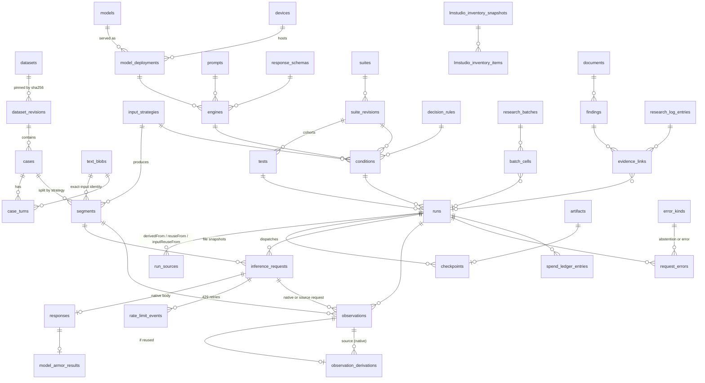

# Research database (Supabase / Postgres)

This is a private Postgres schema for the injection-detection research data that is **not** on GitHub. That data is the git-ignored
`evals/runs/` (about 1.0 GB, about 1,240 files) and `evals/private/` (about 882 MB), plus the tracked metadata that gives
it meaning (`evals/datasets/*.json`, `evals/suites/*.json`, `evals/src/types.ts`, reports, `FINDINGS.md`).

- **Source of truth:** `supabase/migrations/*.sql`, applied in filename order. There is no separate schema snapshot.
- **Single user, private:** every object lives in the `evals` schema, nothing is granted to `anon`, every table has RLS
  with owner-only policies, and the Data API does not expose `evals` unless you add it.
- **Nothing here touches `evals/runs` or `evals/private`.** `check_import_assumptions.py` is read-only.

| File | Purpose |
| --- | --- |
| `supabase/config.toml` | Minimal CLI config with no secrets. `evals` is not in `[api].schemas`. |
| `supabase/migrations/20261004090000_extensions_and_enums.sql` | `evals` schema, pgcrypto, owner allowlist, `is_owner()`, the policy helper, the `sha256_hex` domain, enums |
| `…090100_reference_metadata.sql` | artifacts, datasets/revisions, models/deployments/devices, prompts, response schemas, engines, input strategies, decision rules, suites/revisions, tests, conditions |
| `…090200_cases_and_segments.sql` | content-addressed `text_blobs`, cases, turns, segments |
| `…090300_runs_and_observations.sql` | runs, run sources (derivation and reuse), checkpoints, requests, rate limits, responses, Model Armor results, LM Studio instance snapshots, observations, derivations, error kinds, errors |
| `…090400_budget_inventory_reports.sql` | batches and cells, spend ledger, key snapshots, endpoint snapshots and offers, LM Studio inventories, driver events, file inventories, analysis documents, coverage cells, case evidence tags, documents, research-log entries, findings, evidence links |
| `…090500_analysis_views.sql` | outcome, verdict, rate, paired-delta, spend, lineage and catalog views |
| `…090600_rls_and_storage.sql` | re-applies policies, asserts RLS on every table, revokes anon/PUBLIC, creates private Storage buckets and object policies |
| `supabase/optional/publish_aggregate_views.sql` | **Not applied.** A commented template for publishing aggregate-only materialized views later |
| `evals/db/check_import_assumptions.py` | Read-only scan of `evals/runs` that checks the identity assumptions below |

## Applying the migrations

```sh
# Hosted project, with the Supabase CLI
supabase link --project-ref <ref>
supabase db push                 # applies pending files in supabase/migrations
# Local stack
supabase start && supabase migration up
# Plain Postgres 15+ (also works; role/auth/storage shims are guarded)
for f in supabase/migrations/*.sql; do psql "$DATABASE_URL" -v ON_ERROR_STOP=1 -f "$f"; done
```

Then register yourself as the owner. Use service_role or the SQL editor; `authenticated` cannot write this table:

```sql
insert into evals.owners (user_id, note) values ('<auth.users.id>', 'owner');
```

The importer should connect as `service_role` (or the `postgres` role), which bypasses RLS. Querying through the
Data API requires adding `evals` to the exposed schemas. Even then, only the listed owner sees rows.

**Adding a migration:** run `supabase migration new <name>` (or create `supabase/migrations/<YYYYMMDDHHMMSS>_<name>.sql` with a
later timestamp). Never edit an applied file. Every new table must, in the same file:
`alter table evals.<t> enable row level security; select evals.apply_owner_policies('evals.<t>');`. The final RLS
assertion in `090600` fails on re-run if a table lacks RLS, so re-run it (or copy its assertion block) after adding
tables. Extend an enum with `alter type evals.<enum> add value if not exists '<v>';`. Use `create … if not exists`,
`create or replace view` and `drop policy if exists` so files stay re-runnable.

## ER overview



## Key identities (checked against the real files)

`check_import_assumptions.py` confirmed these on 2026-10-04, while another agent was still appending checkpoints:

| Identity | Natural key | Notes |
| --- | --- | --- |
| Dataset revision | `(dataset_id, revision)`. `revision = 'sha256:' ‖ source sha256` | 21 manifests |
| Case | `(dataset_revision, case_id)`. `text_sha256` = sha256 of turns joined by `\n` | about 7,330 cases referenced |
| Segment | `(case, strategy config hash, index)` | `segment_id` (`<caseId>/<n>`) repeats across strategies. About 60.8k segments and 37.4k distinct input hashes |
| Engine | `engineConfigSha256` = sha256(`JSON.stringify(engine)`) | 51 ids, one hash each. Python `json.dumps(..., separators=(',',':'), ensure_ascii=False)` reproduces every hash |
| Strategy | `inputStrategySha256` | 10 ids |
| Decision rule | importer sha256 of the rule JSON | 3 suite rules, plus replay rules |
| Run | `metadata.runId` | 642 runs in 643 files. One run is a byte-identical copy at two paths (two checkpoints, one run) |
| Request | `requestId` (UUID) | Unique across all checkpoints. 429 retries reuse it with `attempt` 2..8 |
| Observation | `(run, segment)` | Derived observations keep the **source** `requestId`, so `request_id` is not unique on observations |
| Checkpoint snapshot | `(path, sha256)` on `artifacts` | Growing files get a new artifact row at each import |
| Append-only logs | `(path, line_no)` plus `line_sha256` | Ledgers, driver logs |

## Record types found and their mapping

Counts are from the scan on 2026-10-04 and are still growing.

| Source record | Count | Table(s) |
| --- | ---: | --- |
| `metadata` (`security-eval-run/v1`) | 643 | `runs` (+`metadata` jsonb), `run_sources` (`derivedFrom` 69, `reuseFrom` 3, `inputReuseFrom` 3), engine/strategy/rule upserts, `suite_revisions` (hash-only if the file changed) |
| `dispatch` {requestId, attempt} | 247.8k | `inference_requests` (attempts folded into `attempts`, `first/last_dispatch_at`) |
| `rateLimit` {delayMs, raw?} | 3.7k | `rate_limit_events` |
| `response` {raw} | 244k | `responses` (shape-specific extraction), `model_armor_results`, `lmstudio_instance_snapshots` (before/after) |
| `observation` {value} | 243.8k | `observations` (`origin = native`) |
| `derived_observation` {value, raw, source*} | 75.4k | `observations` (non-native origin) + `observation_derivations`. The duplicated `raw` is **not** stored; it is checked against the source response's `raw_sha256` (`raw_matches_source`) |
| `error` {issue, errorName, wireResponse, httpFailure} | 293 | `request_errors`. Issue kinds: provider_or_transport_error 220, output_abstention 52, research_dispatch_cap 16, http_error 7 |
| `complete` {observations} | 593 | `checkpoints.has_complete_marker`, `runs.completeness = complete` |
| `migrated-2026-09/observations.jsonl` (untyped) | 52,335 | `runs` (`origin = legacy_migrated`), `observations` (`legacy_migrated`, null request id) |
| `migrated-2026-09/manifest.json` | 1 | `analysis_documents` (verification totals) |
| Legacy `assistant-2026-09/*events*.jsonl` (`chunk`, `score`, `modelArmor`, `chatResponse`, `result`, `dispatch`, `error`, `complete`) | about 120k | `artifacts` + Storage only. The canonical rows are the migrated observations above, which reference these files through `source_artifact` |
| `batch-ledger.jsonl` (`batch_start/finish`, `condition_start/finish`, `budget_stop`) | 44 + 597 + 8 | `research_batches`, `batch_cells`, `spend_ledger_entries` (`openrouter_usage`, from `usageDeltaUsd`) |
| `armor-budget-2026-09-29.jsonl` (`baseline`, `reserve`) | 1 + 41k | `spend_ledger_entries` (`model_armor_allowance`) |
| `final-budget.json`, batch `initial/final/before/after` | small | `provider_key_snapshots` |
| `model-endpoints-*/*.json`, `openrouter-models-*.json` | 7 | `endpoint_snapshots`, `endpoint_offers` |
| `lmstudio-connection-*/inventory*.json`, driver `inventory` events | about 25 + n | `lmstudio_inventory_snapshots`, `lmstudio_inventory_items` → `model_deployments`, `devices` |
| `driver.ndjson`, `driver-control.ndjson` ({at, value}) | 17 files | `driver_events` |
| `*/artifact-inventory.json` + `inventory-result.json` | 2 × 52k entries | `file_inventories`, `file_inventory_entries` |
| `research-coverage-ledger.json` | 1 | `coverage_cells` + `analysis_documents` |
| Plans, summaries, comparisons, audits, diagnostics, `*-snapshots/<sha>.json` | about 400 | `analysis_documents` (body if under 1 MB), `analysis_document_runs` |
| `attack-following-evidence-*/case-index.jsonl` | 72 | `case_evidence_tags` |
| `*.log`, `console.log`, `*.ts`/`*.py` helper scripts, figures, `research-literature-*` | about 120 | `artifacts` + Storage only |
| `evals/datasets/*.json` | 21 | `datasets`, `dataset_revisions` (license from `provenance.license`) |
| `evals/private/sources/*.jsonl`, `datasets/*.jsonl`, the NotInject JSON | 21 | `cases`, `case_turns`, `text_blobs` (+ Storage `eval-sources`) |
| `*-provenance.json`, `private/upstream/*` | — | `artifacts` (+ optional Storage) |
| `evals/suites/*.json` | 45 | `suites`, `suite_revisions` (content), `tests`, `conditions`, `condition_tests` |
| `evals/reports/*.md`, `research-log-2026-09-29.md`, `FINDINGS.md` | 61 + 2 | `documents`, `research_log_entries` (R0..Rn), `findings` (O1..On), `evidence_links` |

**Response shapes** (`responses.shape`): `openai_chat` (150k: OpenRouter, with usage/cost/reasoning_tokens),
`model_armor_assessment[_native]` (64k: binary verdict, with native `sanitizationResult` and filter version once capture
was added), `jev_answers` (20k: `answers.injection.noul`), `lmstudio_envelope` (9.5k: `lmstudio-provenance/v1`
`{nativeResponse, lmStudio.before/after}`). Finish reasons seen: stop 159k, length 220, error 2.

## Methodology encoded in the schema

- **One observation per segment.** Nothing is aggregated at capture. `v_case_verdicts*` applies a decision rule, so
  thresholds replay over the same saved scores (`decision_rules.origin = 'replay'`).
- **Abstentions are not misses.** `error_kinds.is_abstention` marks `output_abstention` and `length_abstention`. The
  importer assigns `length_abstention` when the paired response has `finish_reason = 'length'`. A case that is
  undecided only because of abstentions has verdict `abstained`. Missing work or hard errors give `incomplete`.
  Rates report `detection_rate` over decided positives and `detection_rate_floor` over all positives.
- **Observed flags.** For max/any rules one scored segment over the threshold decides `flagged`, even when other
  segments are unscored, as `summarize-lmstudio.ts` does. `passed` needs every expected segment scored.
- **Invalid outputs are kept.** `responses.output_text` stores the final content verbatim. Raw bodies of failed
  outputs (`EngineResponseError`) are responses too, and every non-429 HTTP body is in `request_errors.wire_body`.
- **Exact-input reuse is explicit.** Runs carry `origin` and `run_sources`. Observations carry `origin`
  (`derived_segment_equivalence`, `reused_full_input`, `dedup_same_run`, `dedup_native_input`).
  `observation_derivations` links each one to the native observation and request it copies. `v_run_spend` counts only
  native responses as incremental cost. Reused rows are not independent model draws.
- **Limited cohorts are separate.** `runs.case_limit`/`is_limited` exclude `--limit` cohorts from full-cohort pairings.
- **Model Armor is a binary verdict.** `raw_score` stays null. Binary rules apply only to `model_armor` engines.
- **Local caveats are recorded, not hidden.** LM Studio durations include relay and provenance checks. Costs are null,
  not zero. `model_deployments.runtime` says when the runtime build is unknown.

## Views

| View | Use |
| --- | --- |
| `v_run_cases` | Cohort membership (dataset revision + selector + `case_limit` by ordinal) |
| `v_segment_outcomes` | Every expected (run, segment): `scored` / `abstained` / `error` / `unscored` |
| `v_case_verdicts_by_rule`, `v_case_verdicts` | Case verdicts under any applicable rule, or under the run's own rule |
| `v_condition_rates_by_rule`, `v_condition_rates` | Per run (test × condition): detected/missed/clean flags/abstained/incomplete and rates |
| `v_full_vs_window_case_pairs`, `v_full_vs_window_deltas` | Full text vs windows/chunks on the same engine config, rule, dataset, selector, limit and turn selection. Paired counts, McNemar b/c cells, deltas |
| `v_run_spend` | Native requests, attempts, cost, tokens, length-limited responses, reused rows, rate limits, Armor allowance |
| `v_reuse_lineage` | Each reused observation, its source run, and an exact-input check |
| `v_engine_catalog` | Engine → deployment → model (MoE/dense, params, quantization, backend) |
| `v_finding_evidence` | O-ids resolved to runs, including directory-prefix evidence |
| `v_latest_artifacts` | Newest snapshot per path |

`v_segment_outcomes` needs **every expected segment materialized** (by replaying `segmentCase` from
`evals/src/strategies.ts`). Segments recovered only from observations would hide unscored work.

## Storage plan (Supabase Storage, all buckets private)

| Bucket | Contents | Layout | Size |
| --- | --- | --- | --- |
| `eval-runs` | Every file under `evals/runs/` (checkpoints, legacy logs, driver logs, analysis JSON, snapshots, scripts) | `by-sha256/<aa>/<sha256>.<ext>.gz`, content-addressed, so copies and unchanged files dedupe. `artifacts.path → storage_object` | about **92 MB** gzip (measured tar.gz of 1.0 GB; checkpoints compress to 6-7%) |
| `eval-sources` | `private/sources/*.jsonl` + provenance, git-ignored `datasets/*.jsonl` | `sources/<dataset_id>/<source_sha256>.jsonl.gz` | about **14 MB** gzip (measured) |
| `eval-upstream` | Optional tarballs of `private/upstream/*` (AgentDyn 760 MB, PIDS, Skill-Inject, LongPIBench) | `upstream/<name>@<commit>.tar.gz` | about **191 MB** gzip. Better: skip, and re-fetch the pinned commits recorded in manifests |

Per-file limit 50 MB (free tier). The largest checkpoint is 64 MB raw and about 5 MB gzip. A response's raw body is found
by `responses.raw_artifact_id` + `raw_line_no`: download and gunzip the checkpoint object, then read that line.

## Size estimates and the 500 MB free-tier limit

These were measured by loading synthetic rows at **current production volume** into Postgres 16 with these migrations
(indexes included, without raw bodies or source text):

| Table | Rows | Size |
| --- | ---: | ---: |
| observations | 371k (244k native + 75k reused + 52k legacy) | 134 MB |
| responses (extracted columns, no raw) | 244k | 80 MB |
| inference_requests | 244k | 39 MB |
| segments | 61k | 26 MB |
| observation_derivations | 75k | 20 MB |
| text_blobs (hash only) + cases + turns | about 70k / 7.3k / 15k | 28 MB |
| **Normalized core total** | | **about 337 MB** |
| Plus inventories, analysis bodies, ledgers, driver events, findings (estimate) | | +30-60 MB |

- **Raw response bodies as JSONB: about 350 MB.** A measured 10.9k-body sample took 13 MB as JSONB against 9.5 MB of
  JSON, because rows are too small for TOAST compression. 272 MB of JSON therefore cannot fit on the free tier. Keep raw
  bodies in Storage (`responses.raw` null), and populate `raw` only for errors, abstentions and anomalies
  (about 600 rows).
- **Case text:** about 60 MB raw (about 30-40 MB after TOAST). Storing every distinct segment text would be several
  times larger (estimate). Segments can be rebuilt from case text plus `start_word/end_word`.
- **Free tier (500 MB DB, 1 GB Storage):** the normalized core plus metadata uses about 75-80% of the database. Runs
  are still being added, so expect to outgrow it. On the free tier, skip `file_inventory_entries` and analysis
  bodies over 256 KB. For native rows, `observations.provider/resolved_model/response_ids` can be left null because
  `responses` holds them (about 25 MB saved). **Pro (8 GB)** can hold everything, including raw JSONB
  (about 750 MB total).

## RLS, privacy and licensing

- Every table enables RLS **in the migration that creates it**, with two policies: `owner_all`
  (`authenticated` and `evals.is_owner()`) and `service_role_all`. `evals.owners` is self-read only. Migration
  `090600` asserts that RLS is on for every table, and revokes everything from `anon` and `PUBLIC` (schema, tables,
  sequences, functions). Views are `security_invoker`, so base-table RLS applies through them.
- Storage buckets are `public = false`, and object access needs `evals.is_owner()`.
- **Source datasets carry mixed licenses and visibility.** `llmail-phase2-positive-400` is `visibility: private`. Several
  "public" cohorts inherit research-only or noncommercial terms (PIDS and encoding sets: Qualifire CC BY-NC 4.0,
  Dolly CC BY-SA 3.0; Skill-Inject: inherited skill terms, including Anthropic document-skill terms). NotInject has
  no license recorded in its manifest. **Some licenses restrict redistribution**, so case text, raw bodies (which
  can echo inputs) and source files must never be exposed publicly. `dataset_revisions.redistribution_allowed`
  defaults to false.
- Other private details: `engines.armor_project_ref` (GCP project id), `devices.display_name` (host name), and LM Studio
  device ids.
- The optional `supabase/optional/publish_aggregate_views.sql` shows how to publish **aggregate-only materialized
  views** in a separate `evals_public` schema later (anon reads the stored rows only). Before using it, check that each
  dataset's terms allow publishing derived statistics.

## Import plan (not implemented)

Run as `service_role` from a separate process. Read the repo, never modify `evals/runs` or `evals/private`, and
skip a checkpoint's partial final line (an active writer). Every step upserts on a natural key, so re-runs are no-ops.

1. **Artifacts.** Walk `evals/runs`, `evals/private` and the git-ignored `datasets/*.jsonl`. Hash each file, upsert
   `artifacts (path, sha256)`, gzip it, upload it to `by-sha256/…` if missing, and set `storage_*`. An unchanged hash
   is skipped.
2. **Datasets.** Upsert `datasets` and `dataset_revisions` from `evals/datasets/*.json`, checking `source_sha256`
   against the artifact.
3. **Cases.** Use the same rules as `loadDataset` (numeric legacy ids become strings; LLMail and NotInject become one
   `<id>/source` document turn). Insert `text_blobs` hashes first (with `body` only if allowed), then `cases`
   (`on conflict (dataset_revision_id, case_id) do nothing`) and `case_turns`. Facet projections:
   `attack_family = attack_family|attack|attack_type|injection_family|technique`,
   `attack_template = attack_variant|goal|obfuscation|encoding`, `attack_position = position|insertion_position`,
   `domain = domain|surface|task`, `pair_key = pair_id|pair_family|document_family`,
   `parent_case_id = parent_case|parent_default_case`.
4. **Catalog.** Upsert prompts (texts from `evals/src/engines.ts`, hashes checked by constraint), models, devices and
   deployments (from LM Studio inventories, endpoint snapshots and the `lmStudio` engine block; MoE/dense and params
   from model cards and the FINDINGS table), engines, strategies and rules (hash = `engineConfigSha256` etc.), then
   suites, `suite_revisions` (sha256 of file text), tests, conditions and condition_tests.
5. **Segments.** For every (case, strategy) used by any run, replay `segmentCase` (a small Bun script that imports
   `evals/src/strategies.ts`). Upsert `segments` on `(case, strategy, index)` with word offsets.
6. **Runs, in dependency order.** Live sources first, then `inputReuseFrom` sources, then `reuseFrom` and `derivedFrom`
   targets (topological over `run_sources`). Then the legacy migrated run set. For each checkpoint: upsert `runs` on
   `run_id`, `checkpoints` on `artifact_id`, and mark the newest snapshot canonical.
7. **Events, in file order.** `dispatch` → `inference_requests` (`on conflict (request_id)` update attempts/last
   time). `rateLimit` → `rate_limit_events`. `response` → `responses` (+ `model_armor_results`, LM Studio snapshots;
   `raw` null by default; `raw_line_no` set). `observation` → `observations` (check `inputSha256` = segment hash, and
   engine/strategy hashes = run). `derived_observation` → `observations` + `observation_derivations`
   (`source_observation_pk` found through the source request id; check the source observation hash and raw hash).
   `error` → `request_errors` (`outcome_kind` = `length_abstention` when the paired response is length-limited, else
   `issue.kind`). `complete` → checkpoint and run completeness.
8. **Ledgers and logs.** Batch ledgers, the Armor allowance ledger, key snapshots, driver events, inventories and
   coverage ledgers, keyed by `(path, line_no)` or by file.
9. **Documents.** Reports, research-log `### Rn —` sections, FINDINGS `**On:` blocks (strength, confounds,
   follow-up, the checkmark), and evidence links parsed from `runs/...` paths (`path_prefix`) and report links.
10. **Verify.** For each run, compare `v_condition_rates` with `research-analysis.json` and `migrated-2026-09/manifest.json`
    totals. Check completion marker counts, and that every `request_errors.segment_pk` and derived source resolves.

Before writing an importer, run `python3 -B evals/db/check_import_assumptions.py`. It fails if a new record type,
error kind, response shape, non-UUID request id or irreproducible hash appears.

## Validation performed

The migrations were applied in order to a fresh `postgres:16-alpine` container, **twice** (idempotent re-run, no
errors). The storage section was skipped there because no storage schema exists. A synthetic smoke test checked
verdict semantics (observed flag, abstention not counted as a miss, paired deltas). An RLS test confirmed that anon
gets "permission denied for schema", a non-owner authenticated user sees 0 rows in tables and views, and the owner
and service_role see everything. The optional publish template was tested uncommented: anon can read the
materialized aggregates and nothing else. The Supabase-specific parts (`storage.buckets`, policies on
`storage.objects`) were reviewed by hand but not executed.

## Open questions

1. Should full source **case text** be stored in Postgres (`text_blobs.body`, about 30-40 MB), or should the database
   stay hash-only with text in `eval-sources`? This matters for license-restricted cohorts.
2. Should **raw bodies** live in Postgres (needs Pro) or only in Storage, with `raw` filled for failures and anomalies?
3. Should the `private/upstream` clones (191 MB gzip) be uploaded, or rebuilt from pinned commits?
4. Which source is authoritative for **MoE/dense and total/active parameters**? Today it is ad hoc in reports and
   FINDINGS. Jev's architecture is unverified.
5. Should replay rules (thresholds 0.3-0.99 × max/mean/min) be loaded for all runs? The `*_by_rule` views grow with them.
