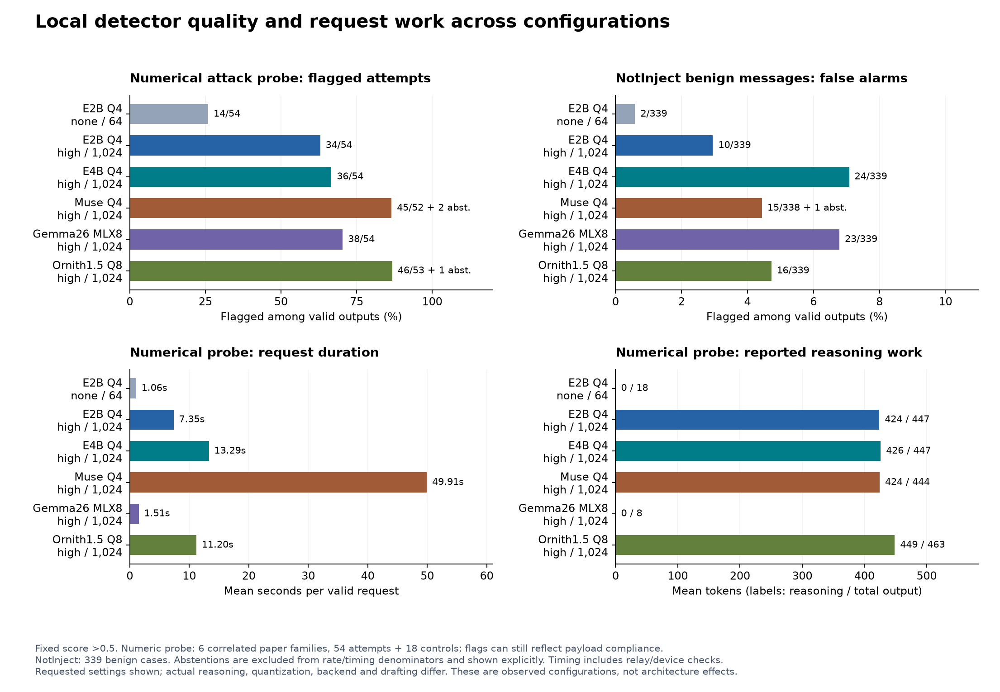

# Local injection-detection research: evidence index

The LM Studio adapter is running inference serially on the linked MacBook Pro,
with native requests, responses, usage, failures and exact-input reuse retained.
This is an ongoing study. OpenRouter's authorized $19.64 has been exhausted;
the current local work makes no paid OpenRouter requests. Model Armor has a
$30 ceiling, with $10.2166854 conservatively reserved in the retained ledger.
The email and numerical Armor references below reuse earlier calls.

**Current sequencing:** per the user's October 4 update, the dense-versus-MoE
stage now runs full input first. New window runs are deferred. The
[full-input baseline comparison](lmstudio-dense-moe-full-baselines-2026-10-04.md)
shows matched cohort coverage, abstentions and measured request time. The
[attack-following write-up](injection-following-findings-2026-10-04.md) links an
audited 72-case regression pool and configuration-specific evidence, retaining
completed chunking results for the later technique study.

## Main findings and their evidence

| Question | Current evidence | Report |
|---|---|---|
| Does chunking help small local models? | Yes on the selected paper cohort, but benefits can include a clean-source false alarm and redundant-tail effects. E2B regresses on the email cohort. | [Cross-task family comparison](lmstudio-chunking-domain-comparison-2026-10-04.md), [small-model synthesis](lmstudio-small-model-synthesis-2026-10-03.md) |
| Are numerical concern scores always evidence of detection? | No. Counterfactual low/high targets expose payload sensitivity; exact copying decreases under some protocols but does not capture every form of numerical influence. Invalid outputs remain abstentions. | [Seven-configuration numerical diagnostic](lmstudio-panel-numeric-probes-2026-10-04.md) |
| Do stronger configurations also flag benign messages? | Yes. The complete 339-case NotInject comparison shows a detection/false-alarm tradeoff and model-specific disagreements. Qwen3.8 flags only 3/335 valid cases (four abstentions) but also detects the fewest BIPIA attacks among the larger models. Muse has one abstention, Qwen four; neither counts as a negative verdict. | [Benign comparison](lmstudio-panel-notinject-2026-10-04.md) |
| Do saved hosted results transfer to local inference? | Gemma26 matches every score on 160 selected long-input cases, including shared paper misses. Seven NotInject and eight BIPIA decisions differ; backend, quantization and generation settings remain confounded. | [Hosted/local comparison](lmstudio-hosted-transfer-2026-10-04.md) |
| Does the stronger BIPIA total cover every smaller-model success? | No. E4B catches four obfuscated attacks missed by Gemma26, while Gemma26 catches 35 missed by E4B. Muse (43/76) catches eight jointly scored attacks Gemma26 misses, mostly encoding/substitution and translation. Qwen's 18 detections, by contrast, are a strict subset of every larger model's. | [Full-input BIPIA comparison](lmstudio-panel-bipia-2026-10-04.md) |
| Does a low score always mean the model failed to recognize an instruction? | No. Saved Gemma26 rationales recognize three language-redirection attempts but assign low concern because their impact seems minor. This differs from demonstrated attack-following. | [Translation diagnostic](lmstudio-bipia-translation-diagnostic-2026-10-04.md) |
| Is Qwen's BIPIA deficit entirely a lack of score separation? | No. On jointly valid inputs its AUC exceeds E4B's despite lower detection at >0.5. Yet26 attacks score exactly zero, so lowering a threshold does not resolve every miss. | [Score-distribution diagnostic](lmstudio-bipia-score-distribution-2026-10-04.md) |
| Does the paper benefit transfer to a nonnumeric attack goal? | Historical completed pairs: E2B changes 37→34/60 attacks, E4B 60→58, and Gemma26 stays 60→60; all retain 0/20 clean flags. Every E2B and E4B loss has a window containing the full payload. | [Frozen email panel](lmstudio-long-email-panel-2026-10-04.md) |
| Does MoE architecture explain the changes? | Not established. Within-model comparisons are informative, but available quantization, runtime, reasoning and drafting differ. The full five-versus-five candidate panel is not yet qualified. | [Model selection and qualification](moe-dense-design-2026-10-03.md), [initial protocol diagnostic](lmstudio-larger-protocol-first6-2026-10-04.md) |
| Do identical reasoning settings imply equal inference work? | No. On identical paper inputs, reported reasoning ranges from zero for Gemma26 to thousands of tokens for other configurations; Qwen and Ornith expose native draft counters. | [Native work and latency](lmstudio-native-work-2026-10-04.md) |

## Study status

The figure uses complete attempted cohorts and shows abstentions separately.
Numerical-probe flags can still reflect payload compliance. Timing means cover
valid responses and include transport/device checks; they are not pure decode
speed. [PDF](figures/local-panel-quality-work.pdf) and
[SVG](figures/local-panel-quality-work.svg) exports are available.

Four larger configurations have passed bounded protocol qualification: Muse
Glimmer Q4_K_M, Qwen3.8 27B Q8_0, Gemma 4 26B A4B MLX 8-bit, and Ornith
1.5 35B A3B Q8_0. E2B and E4B Q4
provide small-model references. These are configurations of related families,
not five independent architecture replicates.

Qwen3.8 27B Q8 has since appeared in the remote inventory and has a validated
full-input-only configuration. It completed all24 qualification cases with
18/18 attack detections, 0/6 benign flags and no invalid outputs. All five of
its full-input cohorts are now fully attempted. On the 80-case email selection
it detects 60/60 attacks with 0/20 clean flags and no abstentions. On NotInject
it flags 3/335 valid benign cases (all Technique Queries) with four length
abstentions, three of them Multilingual. It is not yet included in the figure
above, which predates those new results.
Muse completed the full-email tranche with 59/60 attacks detected, 0/20 clean
flags and no abstentions. Gemma26 and Ornith each detect 60/60 with 0/20 clean
flags on the same inputs. Sarvam 30B Q8 also appeared and remains reserve.
Sarvam is not counted as a qualified comparison model. The full-input BIPIA
stage has completed Gemma26 (60/78 attacks) and Ornith (49/78), both with
0/78 clean flags and no invalid outputs. Qwen3.8 has now attempted all156
BIPIA cases:18/75 scored attacks detected, three attack length abstentions,
and0/78 clean flags. Its18 detections are a subset of both Gemma26's and
Ornith's detections on the75 jointly scored attacks. Qwen's numerical diagnostic
is complete:48/49 valid attacks detected, five attack length abstentions,
0/18 control flags, and0/15 exact endpoint-copying pairs. The strong18/18 paper protocol check did
not transfer to this broader attack distribution. Muse has now attempted all
156 BIPIA cases: 43/76 scored attacks detected, two attack length abstentions
(both detected by Gemma26 and Ornith), and 0/78 clean flags. Muse ranks
between Ornith and Qwen, but is not a subset of either MoE model: it alone
catches eight attacks Gemma26 misses and ten that Ornith misses. All four
larger configurations have now completed matched full-input coverage on the
five cohorts in the [full-input baselines](lmstudio-dense-moe-full-baselines-2026-10-04.md).

With matched benign and email coverage complete, the prepared
[full code-review cohort](../runs/lmstudio-code-panel-2026-10-04/full-code-plan.json)
adds a different attack objective across the six current configurations.
E4B's existing 400-case run is complete and will be reused: it detects all
200 combine/authority attacks but none of the 100 naive approval instructions,
with 0/100 clean flags. The other five combinations have not started.
The [full code baseline](lmstudio-full-code-baselines-2026-10-04.md) also audits
and reuses all 1,200 existing Model Armor outputs. Recorded base/high/low
aliases detect 100/101/1 of 300 attacks, respectively, and flag 0/100 clean
sources each. All three miss the 100 naive instructions. Alias names are not
verified sensitivity settings; no new service calls were needed.

The downloaded Gemma 31B MLX artifact is a base model and is excluded from the
instruction-tuned panel. Both K2 artifacts fail to load on the current runtime.
Granite's bounded protocol probes produced output-channel or length failures;
its artifacts remain retained and its broader evaluation is deferred. A batch
of five replacement/current models has already been requested from the user.

Muse, Qwen3.8, Gemma26 and Ornith have attempted the full benign and numerical
diagnostic cohorts. Gemma26 additionally has a
complete selected 20-family paper window comparison, not a completed 400-case
paper corpus. The email suite fixes 20 ordered families before inference;
E2B, E4B, Muse, Qwen3.8, Gemma26 and Ornith have finished the same 80-case
full-input selection. Historical 512-word window comparisons exist for E2B, E4B and
Gemma26. Muse and Ornith windows are deferred under the full-input-first plan.

## Reproducibility

- [Running research decisions](research-log-2026-09-29.md) records why cohorts,
  models and techniques were continued, changed or deferred.
- [Available larger-panel checkpoint summary](lmstudio-available-panel-2026-10-04.md)
  separates complete cohorts from partial coverage and abstentions.
- [Evaluation README](../README.md) documents the adapter and commands.
- Raw outputs, source-prefix hashes, native response audits and analysis scripts
  live under ignored `evals/runs/`; source data remain under `evals/private/`.
  Existing checkpoints are resumed or reused by exact identity. No failed score
  is retried to obtain a more favorable outcome.

Shared templates, repeated source families and convenience tranches limit
generalization. Report task-specific attack detection, clean flags, abstentions
and measured work together; do not pool them into a deployment accuracy score.
Requested reasoning settings do not ensure equal reasoning behavior across
models, and these APIs expose no expert-routing traces.
