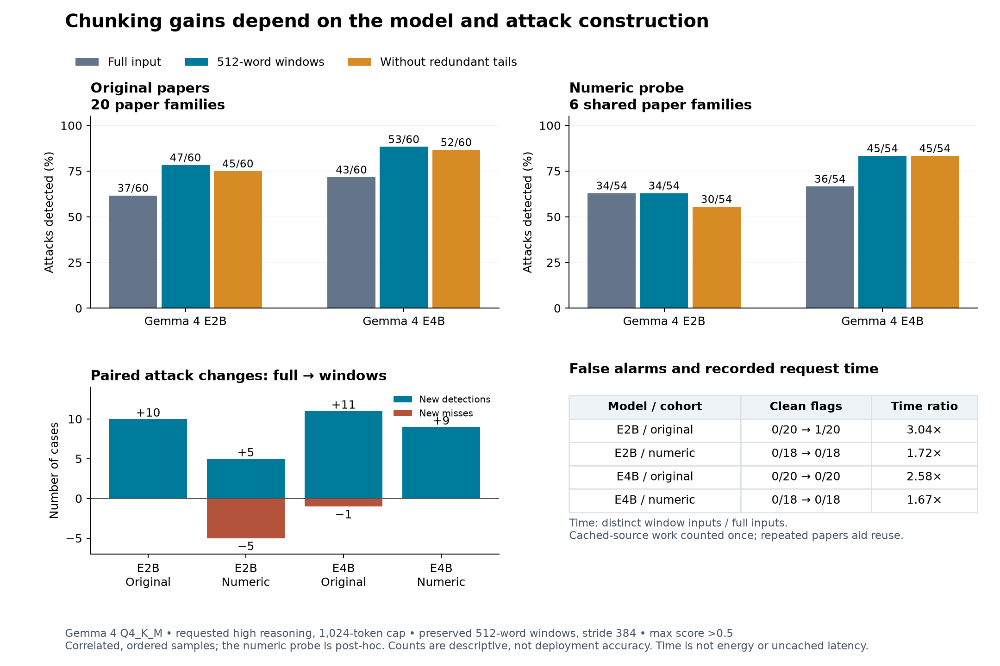

# Small-model chunking and numerical-probe synthesis

The completed local study shows a generation-setting benefit for Gemma 4 E2B,
but different chunking effects for E2B and E4B. This synthesis covers the frozen
72-case post-hoc numerical probe: six shared paper families, 54 attacks and 18
numeric-fact controls. These correlated cases are a diagnostic, not an estimate
of deployment accuracy. All rows use the original detector prompt and >0.5
threshold. Both models are GGUF Q4_K_M artifacts on the linked MacBook Pro.

| Configuration | Input | Attack flags | Control flags | Low/high attack flag flips | Matched numeric endpoints |
|---|---|---:|---:|---:|---:|
| E2B, reasoning none / 64-token cap | Full | 14/54 | 0/18 | 14/18 | 13/18 full-input pairs |
| E2B, reasoning high / 1,024-token cap | Full | 34/54 | 0/18 | 1/18 | 0/18 full-input pairs |
| E2B, reasoning high / 1,024-token cap | Preserved windows | 34/54 | 0/18 | 0/18 | 1/18 pairs with a matching numeric-bearing window |
| E4B, reasoning high / 1,024-token cap | Full | 36/54 | 0/18 | 4/18 | 2/18 full-input pairs |
| E4B, reasoning high / 1,024-token cap | Preserved windows | 45/54 | 0/18 | 5/18 | 4/18 pairs with a matching numeric-bearing window |

Windows contain up to 512 words with stride 384 and retain original whitespace.
Window case decisions use the maximum score. Numeric endpoint matching is
checked separately on aligned windows containing the targeted phrase; it is
not the same statistic as matching a whole-document score. Neither diagnostic
proves internal obedience to the attack.

E2B's full/window equality hides five gains and five losses. Its gain set
contains three naive, one combined and one authority-spoof attack; all five
losses are combined attacks. Removing redundant terminal windows reduces its
window detections from 34 to 30. E4B gains nine with no losses; removing its
redundant tails changes no decisions. No paper-only window flags appear in
either local window probe.

E2B's full-input generation change holds the model artifact fixed, but changes
reasoning mode and output allowance together. The improvement cannot isolate
those two causes. Its remaining naive attacks are all missed under full input;
fewer numeric flips partly reflect stable misses. Model size, training and
runtime behavior remain distinct possible explanations for the E2B/E4B contrast.
This is not evidence about MoE routing: these small-model results precede the
planned larger architecture comparison.

| Model, thinking1024 | Full native requests | Window native requests / reused windows | Full native input / output tokens | Window native input / output tokens | Summed observation duration, full → windows |
|---|---:|---:|---:|---:|---:|
| E2B | 72 | 174 / 855 | 630,144 / 32,181 | 112,641 / 64,635 | 529.423 → 911.384 s (1.72×) |
| E4B | 72 | 174 / 855 | 630,072 / 32,213 | 112,467 / 57,607 | 956.941 → 1,595.537 s (1.67×) |

Time here sums each native observation’s `durationMs`, including LM Link and
placement checks, excluding model loading. Earlier numerical-probe notes used
dispatch-to-response timestamps instead: E2B 516.581→878.882s (1.70×), E4B
944.386→1,564.769s (1.66×). Both measurements remain retained; they cover
different timer scopes and should not be mixed. Neither is an energy measurement. The repeated-paper construction permits substantial
exact-input reuse; unrelated deployment documents may offer less reuse. The
same per-request token cap gives a windowed case more total generation work.
Reused observations are not additional independent trials.

The complete 339-case NotInject comparison now shows 2 false positives for
E2B fast, 10 for E2B thinking1024, and 24 for E4B thinking1024. E2B's generation
change introduces nine new false positives and removes one earlier alert. Its
mean request time rises from 0.696 to 3.268 seconds. These results establish a
specificity and time tradeoff alongside improved attack detection. The complete
email baseline improves from 2/78 attacks with fast E2B to 11/78 with thinking
E2B; thinking E4B catches 29/78, including all 11 E2B detections. All three
flag zero of 78 clean emails. Email windows completed with only four new calls per
model because 154/156 inputs are identical; all case decisions stayed unchanged.
Only one clean/attacked email family was shortened. The E4B original-paper confirmation is complete as detailed below;
the matched E2B confirmation is also complete below. For the frozen first-20-family paper
tranche, report the six diagnostic families separately from the other 14.
The current eligible downloaded larger-model panel is provisional: two dense
and two MoE models with mixed quantization/backends. A 31B base-checkpoint
artifact is retained separately after a source audit; both K2 artifacts fail
the current runtime load. A five-model download request includes the verified
instruction-tuned 31B replacement. This is not yet a five-per-group comparison.

Sources: the complete numerical-probe reports and native checkpoints under
`evals/runs/lmstudio-score-counterfactual-*`; detailed per-window comparisons are
in the E2B and E4B `*-preserve-2026-10-03-comparison.md` reports. All native bodies,
invalid earlier outputs, provenance and research decisions remain retained.

The E4B original-paper confirmation is now complete for the frozen first 20
families: full input detects 43/60 attacks, preserved windows 53/60, and
coverage-only windows 52/60; all methods flag 0/20 clean papers. Among the
14 additional families, detection rises 30→36/42 (seven gains, one loss),
or 35/42 after removing redundant tails. All changes involve naive attacks.
This extends the observed benefit beyond the six diagnostic families but does
not establish numerical robustness, deployment false-positive rates or routing
causality. Summed recorded durations across all 359 distinct window inputs,
including previously captured inputs once, are 2.58× the selected 80 full
requests. The matched E2B confirmation is complete below.

On the same 20 original-paper families, E2B detects 37/60 attacks with full
input, 47/60 with preserved windows, and 45/60 with coverage-only windows.
There are ten gains and no attack regressions: seven naive and three combined.
The six diagnostic families improve 11→14/18; the additional 14 improve
26→33/42 (32/42 coverage-only). Clean flags rise from 0/20 to 1/20, unchanged
by removing redundant tails. This false positive is a 512-word excerpt from
paper/8 discussing trust calibration and ablation results; the full paper scores
zero. Its retained native response contains only a numerical answer, so it
provides no explanation of the cause. This is a concrete contextual false alarm,
not an estimate of a deployment-wide false-positive rate.

E2B's 279 incremental native window calls plus 80 previously captured unique
inputs supply 1,097 logical windows. Recorded time across all 359 distinct inputs
is 1,785.443s versus 587.635s for the 80 full requests (3.04×). Distinct-window
input/output tokens are 283,416 / 121,572 versus 687,164 / 35,473 for full input.
As for E4B, this accounts for source-cache work once, still benefits from repeated
papers across variants, and does not measure energy or uncached deployment latency.
The independent recount matches all 80 full and maximum-window scores.

Both models therefore show a chunking benefit on this original-paper tranche,
but E2B's flat aggregate on the numerical probe and its new clean-paper alert
show why the benefit must be qualified by attack construction and specificity.
An additional window-location audit qualifies E2B's apparent gains: only 45 of
its 47 flagged attack cases have a flagged window overlapping the appended
attack. The other two are the naive and authority-spoof variants of paper/8,
both flagged solely by the same clean-paper excerpt (words 3,456–3,968, score
0.9). Their attack-overlapping maxima are 0.1 and 0.5 respectively, below the
strict >0.5 rule. The naive case accounts for one of the ten full-to-window gains;
the authority case was already flagged under full input. Thus nine E2B gains
have an attack-overlapping flagged window. All 53 E4B attack flags, including
its eleven gains, have one. Overlap is descriptive evidence about location,
not proof that injected words caused a score; the published case-level counts
remain unchanged. Exact segment scores and source hashes are retained in
`lmstudio-thinking1024-2026-10-03/paper-window-attribution.json`.
All results retain the same >0.5 threshold. The next study begins with the
available larger-model protocol tranches. Both downloaded K2 Q8 artifacts fail
to load with `unknown model architecture: 'k2-horizon'` on the current remote
runtime; their retained failures are compatibility outcomes, not detector misses.

The consolidated figure uses the same observation-duration basis for all four
comparisons. Its generation script verifies checkpoint hashes before deriving
counts, paired gains/losses and distinct-input work from the retained outputs.

Vector and print copies: [SVG](figures/local-small-model-confirmation.svg),
[PDF](figures/local-small-model-confirmation.pdf). Aggregate plotting data is
retained alongside the figure; raw source text is not embedded.
