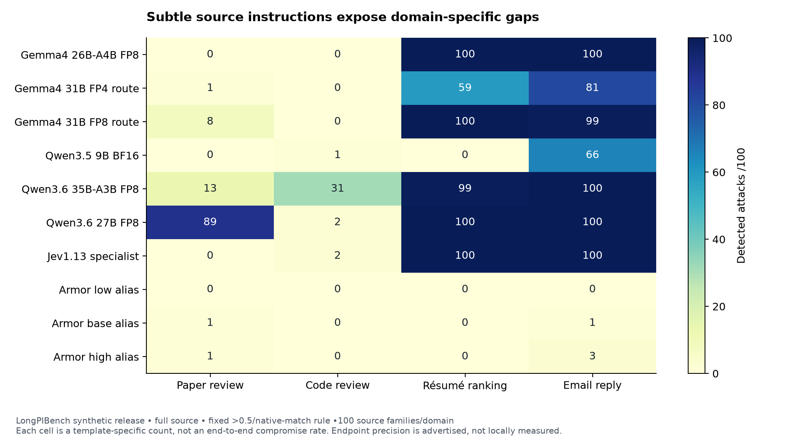
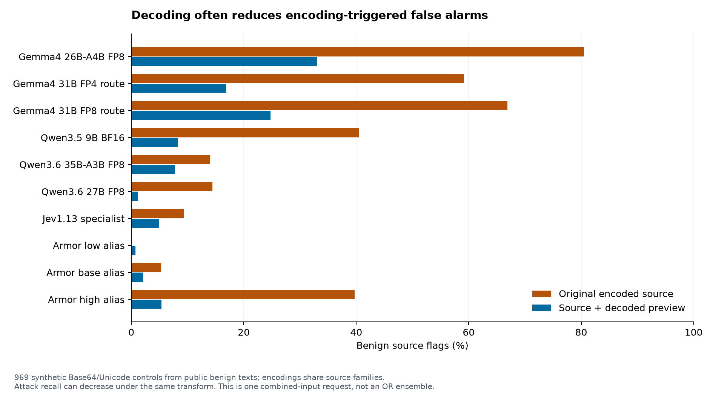

# Injection-detection research: models, source authority, encoding and context

**Research stopped after OpenRouter reported $0 remaining and returned a key-limit error.** No inference remains running. The final budget snapshot is2026-09-30 03:54:17UTC (September29,11:54pm Eastern). The running decision log records the research decisions; earlier R9 closeout language is an earlier snapshot, superseded by the continuous-research instruction.

## Final budget and coverage

OpenRouter total key usage settled at **$20.003645478** against its configured$20 cap, with**$0 remaining**. Starting usage at authorization was$0.361236286, so the observed incremental key usage is**$19.642409192**. Provider-reported usage is$0.003645478 above the configured cap. The final refused request returned HTTP403 with a key-limit message; no further inference was submitted after exhaustion. Concurrent batch usage deltas overlap and must not be summed.

Model Armor's separate guard ledger totals**$9.7441344** of conservative allowance, including the earlier$5.1062379 baseline and38,046 new reservations. This is below the authorized$30 ceiling, without assuming a free tier. It is not actual invoiced spend; no billing telemetry was available. The$30 was an upper guardrail, not a requirement to buy uninformative calls.

| Selected study | Validated complete / selected cells |
|---|---:|
| Initial eight-detector × eight-cohort full/windows |128/128|
| Earlier matched trusted-context study |23/24|
| LongPIBench full source/windows |64/64|
| Coverage-only window replay, zero new inference |32/32|
| AgentDyn observed full-source exposures |24/24|
| Decoded previews including both endpoint replications |30/30|
| Paper-position ablations |24/24|
| New FP8/dense-model full-source baselines |30/30|
| Source-authority prompts, six endpoints |73/90|
| LongPIBench matched trusted-context study |27/32|
| Skill policy pairs |6/8|
| **Total selected cells** |**461/486**|

Seventeen source-authority cells were not started before the budget ran out. Seven cells across the old context, LongPI context and skill studies remain incomplete because of retained token-limit abstentions. The remaining LongPI email-withheld cell stopped at187/400 scored cases when the key was exhausted:140 scored attacks were flagged and47 scored benign cases were not. That partial subset is not a complete-cohort accuracy result. One refused dispatch and212 unattempted cases remain explicit in the ledger. Retired/deferred extensions are listed separately and are not silently counted as completed.

The [coverage ledger](research-coverage-2026-09-29.md) identifies every outstanding cell. The [extended results](extended-research-2026-09-29.md), [LongPIBench tables](longpibench-research-2026-09-29.md), [decoded-preview tables](decoded-preview-research-2026-09-29.md) and [running research log](research-log-2026-09-29.md) contain the supporting counts and decisions.

## What the experiments establish

The most useful result is that detector rankings change sharply with the task, attack form, prompt protocol and hosted endpoint. A single aggregate detection score hides the failures that matter for a personal-device assistant. Newer small open models can screen many explicit attacks cheaply, but subtle instructions controlling an assistant's judgment remain a distinct weakness. Encoding sensitivity can also masquerade as excellent attack recall.

These are exploratory screening experiments, not a demonstrated deployed defense or a reproduction of end-to-end attack success rates. No payload, skill, tool action or exfiltration instruction from a benchmark was executed. All inference used the configured OpenRouter or Model Armor APIs; no model was run locally.

## Research scope and controls

The starting point was the latest pushed evaluation branch, `origin/eval/prompt-injection-datasets-and-detectors` at `a55e7097bde5c00494e84a7f8f883f9a1b6af177`. Work remains on `codex/security-eval-lab`. Existing outputs, failed runs, retired techniques and inherited work were retained.

The first complete matrix crossed eight detectors with eight cohorts under full-source and 96-word/64-stride screening: web480, Agent Injection Bench182, AgentDojo21, LLMail400, NotInject339, BIPIA156, PIDS obfuscated405 and PIDS public hard-benign808. The public PIDS set excludes664 withheld LMSYS inputs. Dojo is a small mechanics check, not strong statistical evidence. BIPIA is a paired78-context construction. Attack-only LLMail cannot establish false-positive behavior.

The continuation added LongPIBench's public synthetic release (400 source documents,1600 clean/attack rows across four domains),831 observed AgentDyn tool exposures,969 encoded benign controls,229 transformation-eligible existing rows,234 Skill-Inject policy cases and600 paper-position variants. These counts are not independent samples: templates, source documents, seeds, tasks and encodings recur. The229 eligible rows reuse existing examples, and the600 position variants reuse the same100 papers.

The principal hosted candidates are Gemma4 26B-A4B FP8, Gemma4 31B on DeepInfra's advertised FP4 turbo route, Qwen3.5 9B BF16, and Qwen3.6 35B-A3B FP8. Added controls are Gemma4 31B FP8 and Qwen3.6 27B dense FP8. The 9B model is an explicit small-footprint comparator; older Gemma3/Ministral results remain historical. Jev1.13 is a specialist API baseline with unverified local-weight feasibility. Three existing Model Armor template aliases supply managed-service baselines. Template reads returned403, so alias names are not verified descriptions of actual settings.

All selected open models have nominal weight footprints plausibly within96GB; this is not a local memory or throughput measurement. Total MoE weights still need storage even when fewer parameters are active. Providers, model IDs, prompt hashes, schemas, output caps, source revisions and response identities are captured. Provider fallback is disabled. Score-only inference uses a64-token cap and fixed threshold>0.5; context protocols use256 tokens and preserve malformed capped outputs as abstentions.

## 1. Subtle instructions are a separate detection problem

On LongPIBench's subtle paper-review injections, Gemma26 detects0/100, Qwen9 detects0/100, Qwen35B-A3B detects13/100, and Gemma31's FP4 route detects1/100. The same models often detect nearly every explicit combined override or authority-spoofing variant. Email and résumé variants can be easy even when paper and code variants fail. This rules out treating these failures as a single generic long-context limitation.

Qwen3.6 27B dense detects89/100 subtle paper attacks, but only2/100 subtle code attacks. Its larger active capacity is useful in one domain and fails to solve the other. It also gets269/405 on PIDS obfuscated attacks and22/78 on BIPIA, so its paper result is not a general leaderboard victory.

The added source-authority prompt explicitly distinguishes source evidence from instructions that control the evaluator's output. Gemma26's code detections rise199→289/300 and paper detections200→230/300, with0/100 clean flags in each domain. However, its PIDS hard-benign flags rise19→56/808. For Gemma31 FP8, NotInject flags rise13→44/339. These are useful attack/false-positive tradeoffs, not grounds for adopting the prompt universally. Prompt development was informed by earlier results; these gains are exploratory rather than independent holdout validation.

Position also matters. Gemma26 detects100/100 paper authority variants at the conclusion but76/100 in the method section; its combined-override detections fall100→94. Gemma31 FP4 combined-override detections fall100 at the conclusion to86 at the abstract and71 in the method section. Position variants preserve the upstream attack construction and source family, and unchanged clean controls are reused.

## 2. Encoding recall needs encoded benign controls

The bounded decoded-preview technique preserves original text and appends at most 8 unique readable previews,8k characters each and32k total. It handles strict UTF8 Base64, literal Unicode escapes, percent escapes, normalization and invisible formatting characters. It does not execute, recursively decode, fetch or silently replace the original source. Unchanged cases reuse their existing baseline outputs.

| Detector | Encoded benign flags, original→preview /969 | Base64 attack detections, original→preview /50 |
|---|---:|---:|
| Gemma26 FP8 |780→320|50→50|
| Gemma31 FP4 route |573→163|50→50|
| Gemma31 FP8 route |648→240|50→50|
| Qwen9 BF16 |392→80|50→36|
| Qwen35B-A3B FP8 |136→75|48→40|
| Qwen27B FP8 |140→11|45→41|
| Armor low alias |0→7|0→20|
| Armor base alias |51→20|0→27|
| Armor high alias |385→52|43→44|

High Base64 recall alone can therefore conceal broad sensitivity to encoded content. The results are consistent with that explanation; they do not prove the models' internal reasoning. Qwen27B's11/969 flags and41/50 Base64 detections are a promising operating tradeoff for independent follow-up. Gemma models retain better Base64 recall but still flag many encoded benign inputs. Armor base gains coverage with inexpensive preprocessing, while other transformations can lose detections. Full transformation breakdowns accompany the aggregate report.

An OR cascade over original and decoded scores cannot remove an original false positive. This study instead measures a single request containing original text plus readable previews. The synthetic controls and attack cohorts do not define production prevalence, precision or expected user-interruption rates.

## 3. Hosted endpoint choice changes conclusions

Keeping Gemma31's score-only protocol fixed, the FP8 endpoint improves LongPIBench code detections144→197/300 and LLMail284→318/400 compared with the FP4 turbo route. BIPIA rises38→50/78. PIDS public hard-benign flags remain13/808. Other results, including encoded benign controls, can worsen.

With the source-authority prompt, the FP8 route reaches295/300 paper attacks versus208/300 under its original prompt. Its NotInject flags rise13→44/339, so this does not remove the specificity tradeoff.

This is an **endpoint effect**, not an isolated quantization experiment: backend implementation and serving behavior may differ alongside advertised precision. It also means an apparent26B-versus31B architecture comparison was confounded by endpoint precision. A local deployment should validate the actual quantization/runtime it intends to use.

## 4. Context, rationale prompts and authorization are different variables

Matched context-present/context-withheld conditions use the same neutral source identifiers, rationale schema, provider and token cap. Only the trusted task field changes. This separates actual context effects from a change to the detector prompt or response format.

For Gemma26 on LongPIBench papers, both present and withheld rationale conditions detect300/300, versus200/300 under the score-only baseline. That gain cannot be attributed to supplying the task. Qwen9's paper results do show a large matched context effect:299/300 present versus200/300 withheld. Benefits vary across domains; Gemma31 email detections decrease276 versus291 when the task is present.

Output reliability is part of effectiveness. Qwen9's résumé-present condition scores and flags193 attacks, abstains on 107 attacks at the 256-token cap, and correctly leaves100 clean cases unflagged. Résumé-withheld scores 223 attacks, flags200, and abstains on 77. Reporting193/193 recall would conceal the failures. No score is recovered by regex from malformed output and no cap is silently increased.

Skill-Inject supplies identical skill text under warning and legitimizing trusted policies. A deterministic source-only detector must get50% balanced row accuracy on such opposite-label pairs; buying duplicate policy-blind Armor/Jev calls would add no information. With the policy-aware prompt, Gemma26 gets both sides correct on57/117 pairs versus29/117 under the neutral context prompt; Gemma31 gets61 versus25. Neither is close to resolving authorization reliably.

The upstream labels also have material ambiguity. Qualitative review found cases where the legitimizing policy permits generic placeholders but the inserted instruction demands a derogatory replacement, or encourages critical thinking while the insertion demands a false assertion. Flags on such cases are not necessarily detector mistakes. Original labels and all rationales remain retained; these results are sensitivity to upstream policy labels, not definitive false-positive estimates. The audit was performed after inspecting outputs and is not an independent relabeling study.

## 5. More chunks are not automatically better

The initial96-word window results showed some useful gains, such as Gemma26 PIDS detections327→357/405 while hard-benign flags19→17/808. A few prediction changes occurred even on identical inputs, so all of the gain cannot be credited to segmentation. Temperature zero did not guarantee identical hosted output.

LongPIBench uses 512-word windows with 384-word stride. The inherited sliding rule emits short tails even after an earlier window covers the end. An exact-equivalence replay removes these redundant tails without buying calls. For Gemma26 paper attacks, full-source detection is200/300, windows218/300, and coverage-only windows207/300. Thus11 of the18 net extra detections depend on those short tail views. Qwen9 paper windows224→212 and email237→226 after removing tails. Gemma31 FP4 paper windows233→209 after removing tails, versus201 full source. Report segmentation content, overlap and aggregation explicitly; a label such as 'chunking' is insufficient.

The strongest window result is Qwen35B-A3B on papers:206→300/300 total attack detections, with0/100 clean flags. Coverage-only windows also retain300/300, so this gain is not a redundant-tail artifact. Jev improves200→299/300 with1/100 clean flags; coverage-only windows retain294/300. These results show that an input technique can outweigh moving to a larger active model on this cohort. They do not transfer uniformly: Qwen35B-A3B code detections remain231/300. For the400 paper cases, Qwen35B-A3B full-source inference costs$0.2910 in captured responses versus$0.4582 for sliding windows, while requests rise400→4717. Coverage-only replay retains4581 windows with$0.4541 of reused response cost and no new API charge. Thus request overhead and token cost do not scale identically. Hosted cost does not measure local throughput.

Tiny 7/14/21-word experiments were not expanded. AgentDyn window expansion was also deferred across all models after Gemma26 and Gemma31 each detected649/649 observed attacks with0/182 benign flags. The repeated explicit instruction template was saturated. AgentDyn remains a useful regression cohort, not evidence of general agent safety or a reproduction of its end-to-end benchmark.

## Practical research direction

The most valuable next system to investigate is a small model that distinguishes source facts, source-provided procedures, trusted task authority and requested actions, with a bounded decoding layer and explicit abstention handling. Reusing one model's weights across different prompts may offer more practical value than selecting a larger model from a pooled benchmark score. That is a research direction supported by these failures, not an implemented deployment claim.

An independent next evaluation should freeze the chosen prompts and use new task-specific subtle attacks paired with genuinely authorized instructions, naturally occurring encoded benign data, and policy labels reviewed independently of detector outputs. It should test a concise context-conditioned score schema separately from rationale length, measure the actual local quantization/runtime within96GB, and report user-visible false alarms at realistic prevalence. No benchmark in this run establishes those deployment properties.

## Reproducibility, preservation and limitations

The detailed tables are in the extended, LongPIBench and decoded-preview reports. Ignored analysis JSON retains exact paired discordances, model costs, hosted latency, template facets, policy families and exploratory 4000-replicate cluster-bootstrap intervals. LongPIBench intervals resample source-document families, PIDS resamples seed families and AgentDyn resamples task families. Shared global templates and hypothesis selection remain outside those intervals; zero observed flags do not prove zero population false-positive risk.

Raw source snapshots, checksums, model endpoint snapshots, every captured response, failed/partial checkpoint and budget journal remain under ignored `evals/private/` and `evals/runs/`. Licensing remains source-specific, including PIDS restrictions and inherited Skill-Inject skill terms. No raw artifacts were published. An older runner bug could discard a later in-flight failure body after another worker failed; historical lost bodies cannot be reconstructed. The runner was corrected and regression-tested, and only unresolved requests with no saved scored output were recovered.

Current validation: runtime/eval typechecks pass. The standard full test command reports 128 passes and 5 subprocess failures with Bun EBADF across four test files. Equivalent external temporary copies using absolute import/source paths pass 11/11 with unchanged assertions; this does not make the standard command green. Logs are retained. Final coverage was regenerated after inference stopped. The final artifact inventory is recorded below.

Final preservation inventory: **52,113 files / 1,654,230,213 bytes**, SHA-256`16b7f630b2f571696359f2439afaf7eb5e4474bea4d5210b5700f6dd193872c3`. It covers ordinary files under ignored evals/private and evals/runs, excluding Git internals, Python caches and the inventory/sidecar themselves. Code, manifests, reports and figures remain separately in the working tree. Inventory path: `evals/runs/research-final-2026-09-29/artifact-inventory.json`.

Across retained current-research directories, including inherited runs and limited smoke tests, there are **497 live checkpoints and 44 derived checkpoints**, **234,810 dispatch attempts**, **231,085 saved response events** and **230,886 scored observations**. This accounting scope includes historical/retired work and differs from the461 selected completed comparison cells. Captured unique priced responses total$20.001668048; unpriced failures and differing scope prevent equating that sum with incremental key usage. Every retained failure and rate-limit event remains available. No inference processes remained at closeout.

## Sources and exact release scope

- [LongPIBench paper](https://arxiv.org/abs/2608.28411), [source repository](https://github.com/liu00222/LongPIBench), [public synthetic dataset](https://huggingface.co/datasets/RainWatcher/LongPIBench): code`c7b80114ae56f65fb8019ec82afdb3df91e4ed65`, data`cdfdfdba8838911ec3d120d5bbf584c0afb280f2`. The unreleased real-world subset is not claimed evaluated.
- [AgentDyn repository](https://github.com/SaFo-Lab/AgentDyn): commit`5353cf7615b135cace8d07c8f12dac53a16b6db3`; actual matching tool exposures from one frozen historical pipeline. The trajectory's GPT model is provenance, not a newly tested detector.
- [PIDS paper](https://arxiv.org/abs/2609.15017), [pinned repository](https://github.com/ShirePyDev/Prompt-Injection-Detection-System/tree/caa329e1cd9fc3a7fb448fa6f413420d9885f4a1): public subsets and transform eligibility documented in manifests.
- [Skill-Inject paper](https://arxiv.org/abs/2602.20156), [repository](https://github.com/aisa-group/skill-inject): commit`182f3d9d9836e81cdae213e9b9cec1d9be96eea3`;39 direct families/117 task placements, excluding script-based attacks. SkillSecurer's advertised repository was inaccessible, so no reproduction is claimed.
- [Qwen3.6 27B model card](https://huggingface.co/Qwen/Qwen3.6-27B), [Gemma memory guidance](https://ai.google.dev/gemma/docs/core), [Model Armor pricing](https://cloud.google.com/security-command-center/pricing): memory feasibility and the conservative cost guard, not local benchmarks or billing telemetry.
